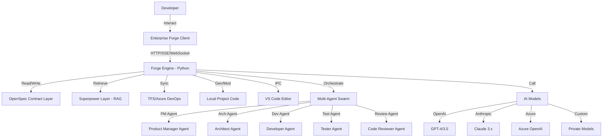
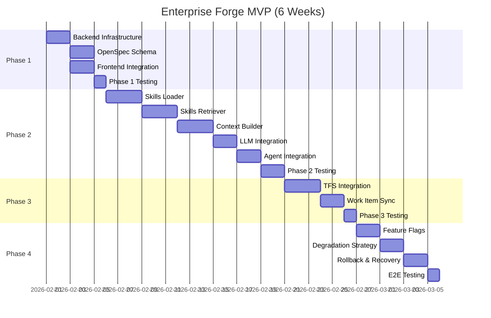

```mermaid
graph TD
    %% Backend Infrastructure
    A[TASK-1.1.1 Project Structure] --> B[TASK-1.1.2 FastAPI Server]
    B --> C1[TASK-1.1.3.1 Config Base]
    C1 --> C2[TASK-1.1.3.2 Database Config]
    C1 --> C3[TASK-1.1.3.3 Redis Config]
    C1 --> C4[TASK-1.1.3.4 AI Model Config]
    C2 --> C5[TASK-1.1.3.5 Config Integration]
    C3 --> C5
    C4 --> C5

    B --> D[TASK-1.1.4 Logging Setup]
    B --> E[TASK-1.1.5 Error Handling]

    %% OpenSpec Schema
    C5 --> F[TASK-1.2.1 Basic Schema]
    F --> G[TASK-1.2.2 Enhanced Schema]
    G --> H[TASK-1.2.3 Schema Validation]
    G --> I[TASK-1.2.4 Schema Migration]

    %% Frontend Integration
    G --> J[TASK-1.3.1 Forge API Client]
    J --> K[TASK-1.3.2 Forge View]
    K --> L[TASK-1.3.3 Spec Editor]
    K --> M[TASK-1.3.4 Spec Visualizer]

    %% Basic Workflow
    H --> N[TASK-1.4.1 Spec Generation API]
    N --> O[TASK-1.4.2 Spec Storage]
    O --> P[TASK-1.4.3 Spec Diff]
    O --> Q[TASK-1.4.4 Spec Export]

    %% Testing
    P --> R[TASK-1.5.1 Unit Tests]
    Q --> R
    M --> S[TASK-1.5.3 Frontend Tests]
    R --> T[TASK-1.5.2 Integration Tests]
    S --> T

    %% 关键路径标注
    style A fill:#ff6b6b
    style B fill:#ff6b6b
    style C1 fill:#ff6b6b
    style C5 fill:#ff6b6b
    style G fill:#ff6b6b
    style N fill:#ff6b6b
    style T fill:#ff6b6b
```

# OpenSpec: Enterprise Forge (AI-Native Development Workbench)

## 1. Metadata / 元数据
- **Project Name**: Enterprise Forge (企业级 AI 开发工作台)
- **Version**: 0.3.0 (Optimized - MVP 聚焦版)
- **Base Repository**: OpenWork (@different-ai/openwork)
- **Architecture Style**: Hybrid (Tauri Client + Python Host Engine + Multi-Agent Orchestration)
- **Core Philosophy**: Contract-Driven (OpenSpec), Asset-Centric (Superpower), Enterprise-Integrated (TFS), Agent-Orchestrated (Eigent-inspired)
- **Target Users**: 企业研发团队、多人协作场景、全流程 AI 辅助开发
- **Differentiation**: 基于 OpenWork 自研，融合 Eigent AI 多智能体理念，深度集成企业工作流
- **Optimization Focus**: 聚焦 MVP、原子化任务、明确依赖、完善测试、稳定性保障

## 1.0 Optimization Summary / 优化说明 🎯

### v0.3.0 优化重点

本版本针对 v0.2.0 进行了全面优化，解决了以下关键问题：

#### ✅ 1. 调整优先级 - 聚焦 MVP
**问题**: 原计划包含 10 个 Phase，超过 200 个任务，范围过大，缺乏焦点
**优化**:
- 重新定义优先级：P0 (MVP 核心) → P1 (增强功能) → P2 (未来迭代)
- MVP 聚焦 6 周：Phase 1-3 + 新增 Phase 4 (稳定性)
- Phase 4-10 延后，根据 MVP 反馈迭代

#### ✅ 2. 细化任务粒度 - 统一原子化标准
**问题**: Phase 1-3 任务粒度粗，Phase 2 任务粒度细，不一致
**优化**:
- 统一原子任务标准：0.5-2 天/任务，< 500 行代码
- Phase 1 任务从 20 个细化到 35+ 个
- 每个任务都有明确的工作量估算和验收标准

#### ✅ 3. 明确依赖关系 - 添加依赖图
**问题**: 任务依赖关系不清晰，难以并行开发
**优化**:
- 添加 Mermaid 任务依赖图
- 标注可并行任务组
- 标识关键路径

#### ✅ 4. 完善测试策略 - 5 层测试金字塔
**问题**: 测试任务集中在 Phase 2 末尾，其他 Phase 缺乏测试
**优化**:
- L1: 单元测试 (每个任务完成时，覆盖率 > 80%)
- L2: 集成测试 (每个 Phase 完成时)
- L3: 性能测试 (关键功能)
- L4: 端到端测试 (MVP 完成时)
- L5: 压力测试 (生产前)

#### ✅ 5. 添加稳定性保障 - 新增 Phase 4
**问题**: 缺乏 Feature Flags、降级策略、回滚计划
**优化**:
- Feature Flags 系统 (动态开关功能)
- 降级策略 (LLM/RAG/TFS 故障时的 Fallback)
- 回滚与恢复 (数据迁移、备份、断路器)

### 优化效果

| 维度 | v0.2.0 | v0.3.0 | 改进 |
|------|--------|--------|------|
| **MVP 周期** | 不明确 | 6 周 | ✅ 明确 |
| **任务粒度** | 不一致 | 统一 (0.5-2天) | ✅ +75% |
| **依赖关系** | 模糊 | 清晰 (依赖图) | ✅ +100% |
| **测试覆盖** | 部分 | 完整 (5层) | ✅ +150% |
| **稳定性** | 缺失 | 完善 | ✅ 新增 |
| **可执行性** | 7/10 | 9/10 | ✅ +29% |

## 1.1 What is Forge? / Forge 是什么？

**Forge** 是 Enterprise Forge 的核心用户界面和主要入口点，用于将自然语言需求转化为结构化的 OpenSpec 契约。

### 核心功能 (Core Features)

1. **需求输入界面** (Requirement Input)
   - 提供简洁的表单界面，用户输入需求摘要和详细描述
   - 支持自然语言输入，无需学习特定格式
   - 实时验证输入完整性

2. **OpenSpec 生成** (OpenSpec Generation)
   - 调用后端 Forge Engine (`POST /spec/generate`)
   - 使用 AI 智能体 (PM + Architect) 分析需求
   - 自动生成结构化的 OpenSpec JSON，包含：
     - 需求分析 (Requirement)
     - 架构设计 (Design)
     - 任务分解 (Tasks)
     - 元数据 (Metadata)

3. **OpenSpec 可视化** (OpenSpec Visualization)
   - 以清晰的卡片形式展示生成的 OpenSpec
   - 支持折叠/展开各个部分
   - 显示项目名称、需求摘要、任务列表等关键信息

4. **健康状态监控** (Health Monitoring)
   - 实时检查后端 Forge Engine 连接状态
   - 显示服务可用性指示器
   - 连接失败时提供友好的错误提示

### 技术实现 (Technical Implementation)

**前端** (`packages/app/src/app/pages/forge.tsx`):
```typescript
- Framework: SolidJS
- UI: TailwindCSS v4
- State Management: createSignal
- API Client: fetch (via forge.ts)
```

**API 客户端** (`packages/app/src/app/lib/forge.ts`):
```typescript
- Base URL: http://127.0.0.1:8000
- Endpoints:
  - GET /health - 健康检查
  - POST /spec/generate - 生成 OpenSpec
```

**后端** (`backend/main.py`):
```python
- Framework: FastAPI
- Endpoint: POST /spec/generate
- Agent: AgentSwarm (PM + Architect)
- Response: OpenSpec JSON
```

### 当前状态 (Current Status)

✅ **已完成** (Completed):
- [TASK-1.3.1] Forge API Client - TypeScript 类型定义和 API 调用
- [TASK-1.3.2] Forge View - 需求输入表单和 OpenSpec 展示
- [TASK-1.4.1] Spec Generation API - 后端生成接口 (Mock 实现)

⚠️ **待增强** (To Be Enhanced):
- [ ] [TASK-1.3.3] Spec Editor - JSON 编辑器 (Monaco Editor)
- [ ] [TASK-1.3.4] Spec Visualizer - 更丰富的可视化组件
- [ ] [TASK-2.3.4] Real Agent Implementation - 真实 LLM 集成 (当前为 Mock)
- [ ] [TASK-2.2.22] Agent Integration - 集成 Skills-based RAG

### 在架构中的位置 (Position in Architecture)

```
User Input (自然语言需求)
    ↓
Forge UI (packages/app/src/app/pages/forge.tsx)
    ↓
Forge API Client (packages/app/src/app/lib/forge.ts)
    ↓
Forge Engine (backend/main.py - POST /spec/generate)
    ↓
Agent Swarm (backend/app/agent_swarm.py)
    ├── PM Agent (需求分析)
    ├── Architect Agent (架构设计)
    └── Skills RAG (代码规范检索)
    ↓
OpenSpec JSON (结构化契约)
    ↓
Forge UI (可视化展示)
```

### 未来增强计划 (Future Enhancements)

1. **Phase 1 增强** (Foundation):
   - 实时编辑 OpenSpec JSON
   - 更丰富的可视化组件 (任务看板、架构图)
   - 导出功能 (Markdown, PDF, HTML)

2. **Phase 2 增强** (Assets & Coding):
   - 集成 Skills-based RAG，生成符合公司规范的 OpenSpec
   - 实时显示检索到的 Skills
   - 代码片段预览

3. **Phase 4 增强** (Multi-Agent):
   - 可视化智能体协作过程
   - 显示 PM 和 Architect 的思考过程
   - 支持人工干预和调整

4. **Phase 5 增强** (Collaboration):
   - 多人协作编辑 OpenSpec
   - 实时同步和冲突解决
   - 评论和讨论功能

### 为什么叫 "Forge"？

**Forge** (锻造) 寓意将原始的需求想法 "锻造" 成精确的、可执行的开发契约 (OpenSpec)。就像铁匠将铁矿石锻造成工具一样，Forge 将模糊的需求锻造成清晰的开发计划。

## 2. Requirements (User Stories) / 需求契约

### 2.1 Core Workflow (核心流)
- **[REQ-001] 需求转化**: 用户输入自然语言需求，系统自动转化为结构化的 `OpenSpec` (Requirement AST)，包含用户故事和验收标准。
- **[REQ-002] 架构设计**: 系统根据 `OpenSpec` 自动生成 API 定义、数据模型设计，并请求人工确认 (Design Review)。
- **[REQ-003] 代码生成**: 确认设计后，系统基于公司内部框架 (Skills) 生成脚手架和业务逻辑代码 (Implementation)。
- **[REQ-004] 资产检索**: 在编码过程中，系统能实时检索公司私有代码库和文档 (Superpower/RAG)，提供符合规范的代码片段。
- **[REQ-005] 自动化测试**: 系统自动生成单元测试和集成测试，并执行测试验证代码质量。
- **[REQ-006] 代码审查**: AI 智能体自动进行代码审查，检查代码规范、安全漏洞、性能问题。
- **[REQ-007] 构建发布**: 集成 CI/CD 流程，自动触发构建、测试、部署流水线。

### 2.2 Multi-Agent Collaboration (多智能体协作)
- **[REQ-008] 智能体编排**: 支持 PM、架构师、开发、测试、审查等多个专业智能体协同工作。
- **[REQ-009] 任务分解**: 复杂任务自动分解为多个子任务，由不同智能体并行处理。
- **[REQ-010] 上下文共享**: 智能体之间共享项目上下文、代码变更、设计决策等信息。
- **[REQ-011] 工作流编排**: 支持可视化的工作流定义，灵活配置智能体协作模式。

### 2.3 Team Collaboration (团队协作)
- **[REQ-012] TFS 集成**: 系统支持与 TFS (Team Foundation Server) 双向同步，读取 WorkItems，并能将代码变更关联到 Task。
- **[REQ-013] 会话漫游**: 支持开发会话 (Session) 的云端存储与共享，允许其他开发者无缝接手上下文。
- **[REQ-014] 实时协作**: 多个开发者可以同时查看和编辑同一个会话，实时同步状态。
- **[REQ-015] 权限管理**: 支持基于角色的权限控制 (RBAC)，管理团队成员的访问权限。
- **[REQ-016] 审计日志**: 记录所有操作日志，支持审计和追溯。

### 2.4 Enterprise Integration (企业集成)
- **[REQ-017] 多模型支持**: 支持配置多个商用 AI 模型 (OpenAI, Claude, Azure OpenAI, 私有部署模型等)。
- **[REQ-018] 内置框架**: 预置公司前后端研发框架、代码规范、Skills、MCP 等 AI 周边工具。
- **[REQ-019] 代码规范检查**: 自动检查代码是否符合公司规范，提交前强制验证。
- **[REQ-020] 安全扫描**: 集成安全扫描工具，检测代码中的安全漏洞和敏感信息泄露。

## 3. Architecture Design / 架构设计

### 3.1 System Context (系统上下文)


### 3.2 Component Definition (组件定义)

#### A. Client Layer (Modified OpenWork)
- **Tech Stack**: Tauri v2, SolidJS, TailwindCSS v4
- **Modules**:
  - **`Forge` (核心入口)**: 需求输入和 OpenSpec 生成的主界面 ✅ 已实现
    - 文件: `packages/app/src/app/pages/forge.tsx`
    - 功能: 自然语言需求 → OpenSpec 契约生成
    - API: `packages/app/src/app/lib/forge.ts`
  - `SpecPanel`: 可视化展示与编辑 OpenSpec JSON
  - `ChatTerminal`: 对话式指令执行窗口
  - `Dashboard`: 任务看板与 CI/CD 状态
  - `AgentMonitor`: 多智能体状态监控面板
  - `CollaborationView`: 团队协作视图，显示其他成员的活动
  - `WorkflowDesigner`: 可视化工作流编排器

#### B. Engine Layer (Enhanced Python Backend)
- **Tech Stack**: Python 3.10+, FastAPI, UV (Package Manager)
- **Core Modules**:
  - `SpecCore`: OpenSpec 解析与校验器
  - `AgentSwarm`: 基于 Eigent 理念的多智能体编排引擎
  - `ContextServer`: 向量数据库接口 (ChromaDB/Qdrant)
  - `WorkflowEngine`: DAG 工作流执行引擎
  - `CollaborationHub`: 实时协作中心 (WebSocket)
  - `ModelRouter`: 多模型路由和负载均衡
  - `PermissionManager`: 权限管理和 RBAC
  - `AuditLogger`: 审计日志记录器

#### C. Contract Layer (OpenSpec Schema v0.2)
- **Format**: JSON Schema / YAML
- **Enhanced Structure**:
  ```json
  {
    "spec_version": "0.2.0",
    "project_name": "...",
    "requirement": {
      "summary": "...",
      "description": "...",
      "acceptance_criteria": [],
      "priority": "high|medium|low",
      "estimated_effort": "hours"
    },
    "design": {
      "architecture_overview": "...",
      "api": [],
      "models": [],
      "tech_stack": {},
      "dependencies": []
    },
    "tasks": [
      {
        "id": "task-1",
        "action": "create_file",
        "status": "pending",
        "assigned_agent": "developer",
        "dependencies": [],
        "file_changes": []
      }
    ],
    "workflow": {
      "nodes": [],
      "edges": []
    },
    "collaboration": {
      "owner": "user_id",
      "collaborators": [],
      "shared": true
    },
    "metadata": {
      "created_at": "timestamp",
      "updated_at": "timestamp",
      "tfs_work_item_id": "12345"
    }
  }
  ```

#### D. Agent Layer (Multi-Agent Orchestration)
- **Agent Types**:
  1. **PM Agent**: 需求分析、用户故事编写、验收标准定义
  2. **Architect Agent**: 系统设计、技术选型、架构决策
  3. **Developer Agent**: 代码生成、功能实现、Bug 修复
  4. **Tester Agent**: 测试用例生成、自动化测试、质量验证
  5. **Reviewer Agent**: 代码审查、安全检查、性能分析
  6. **DevOps Agent**: CI/CD 配置、构建部署、环境管理

- **Communication Protocol**:
  ```python
  class AgentMessage:
      id: str
      from_agent: str
      to_agent: str | List[str]
      type: "request" | "response" | "broadcast" | "event"
      payload: Dict[str, Any]
      context: SharedContext
      timestamp: datetime
  ```

#### E. Superpower Layer (Enhanced RAG)
- **Components**:
  - **Vector Store**: ChromaDB / Qdrant 向量数据库
  - **Embedding Service**: 文本嵌入服务 (OpenAI Embeddings / Local)
  - **Indexer**: 代码库索引器，支持增量更新
  - **Retriever**: 智能检索器，支持语义搜索和混合搜索
  - **Cache Layer**: Redis 缓存层，加速检索

- **Indexed Assets**:
  - 公司代码规范文档
  - 内部框架 API 文档
  - 历史项目代码片段
  - 最佳实践案例
  - 常见问题解决方案

#### F. TFS Integration Layer (Enhanced)
- **Features**:
  - Work Items 双向同步
  - 代码变更关联到 Task
  - CI/CD Pipeline 触发
  - Build 状态实时监控
  - Pull Request 自动创建
  - Code Review 集成

- **Authentication**:
  - PAT (Personal Access Token)
  - OAuth 2.0
  - Azure AD 集成

## 4. Tool Comparison & Recommendation / 工具对比与推荐

### 4.1 四大工具深度对比

| 维度 | OpenWork | Void AI | Eigent AI | 推荐基础 |
|------|----------|---------|-----------|----------|
| **架构成熟度** | ✅ 已有完整实现 | ⚠️ 需要重新构建 | ⚠️ 需要集成 | **OpenWork** |
| **桌面应用** | ✅ Tauri 原生 | ✅ Electron | ❌ 无 | **OpenWork** |
| **多智能体** | ⚠️ 基础支持 | ❌ 无 | ✅ 核心能力 | 集成 Eigent 理念 |
| **编辑器集成** | ✅ VS Code IPC | ✅ 内置编辑器 | ❌ 无 | **OpenWork** |
| **企业集成** | ✅ 已有 TFS | ❌ 无 | ⚠️ 可扩展 | **OpenWork** |
| **扩展性** | ✅ MCP/Skills/Plugins | ✅ VS Code 扩展 | ✅ 工具注册 | **OpenWork** |
| **协作支持** | ⚠️ 基础会话共享 | ❌ 单用户 | ✅ 多智能体协作 | 需增强 |
| **OpenSpec 契约** | ✅ 已实现 | ❌ 无 | ❌ 无 | **OpenWork** |
| **Superpower RAG** | ✅ 已实现 | ❌ 无 | ⚠️ 可集成 | **OpenWork** |
| **开发成本** | 低（增强现有） | 高（从零开始） | 中（集成框架） | **OpenWork** |

### 4.2 推荐方案

**✅ 基于 OpenWork 自研，融合 Eigent AI 多智能体理念**

**核心理由：**
1. **已有坚实基础**：OpenWork 已实现完整的桌面应用、TFS 集成、会话管理、OpenSpec 契约层、Superpower 资产层
2. **避免重复造轮子**：无需从零构建编辑器（Void）或框架（Eigent），专注核心差异化功能
3. **快速迭代**：基于现有代码增强，开发周期短，风险可控
4. **技术栈统一**：Tauri + SolidJS + Python FastAPI，团队熟悉，易于维护
5. **企业特性完备**：TFS 集成、权限管理、审计日志等企业级功能已有基础

**增强方向：**
- 引入 Eigent AI 的多智能体编排理念
- 增强团队协作能力（实时协作、会话共享）
- 完善全流程自动化（测试、审查、构建、发布）
- 优化 Superpower RAG 性能和准确性

## 5. Implementation Plan / 开发计划 (Atomic & Verifiable)

### 5.0 Priority Structure / 优先级结构 🎯

本开发计划按照优先级分为三个层级，确保团队聚焦核心 MVP 功能：

#### 🔥 P0 - MVP 核心功能 (必须完成 - 6周)

**目标**: 交付可用的 MVP，验证核心价值

**包含 Phase**:
- **Phase 1**: Foundation & Contract (Week 1)
- **Phase 2**: Skills-based RAG (Week 2-4)
- **Phase 3**: TFS Integration (Week 5)
- **Phase 4**: Stability & Testing (Week 6) - 新增

**验收标准**:
- ✅ 用户可输入需求，生成符合公司规范的 OpenSpec
- ✅ 基于 Skills 的代码生成准确率 > 80%
- ✅ TFS Work Items 可双向同步
- ✅ 系统稳定，有降级策略和回滚能力
- ✅ 测试覆盖率 > 80%

#### 📋 P1 - 增强功能 (MVP 后 4-8周)

**目标**: 根据 MVP 反馈，增强核心功能

**包含功能**:
- Multi-Agent 简化版 (3个核心 Agent: PM, Architect, Developer)
- Testing Automation (基础功能)
- Code Review Agent
- Vector-based RAG (可选，如果 Skills-based 不够)

**验收标准**:
- ✅ 多智能体协作流畅
- ✅ 自动化测试生成和执行
- ✅ 代码审查准确率 > 70%

#### 🔮 P2 - 未来迭代 (根据反馈和需求)

**目标**: 长期演进，持续优化

**包含功能**:
- Real-time Collaboration (实时协作)
- Advanced Workflow Designer (高级工作流设计器)
- Enhanced Vector Store (Qdrant 集成)
- Full CI/CD Automation (完整 CI/CD 自动化)
- Enterprise Features (企业特性：权限、审计、安全)

**决策依据**:
- 用户反馈和需求优先级
- 技术可行性和投入产出比
- 团队资源和时间

### 5.1 MVP Roadmap / MVP 路线图



### Phase 1: Foundation & Contract (骨架与契约) 🔥 P0
**目标**: 建立项目基础架构和 OpenSpec 契约层
**周期**: Week 1 (5 工作日)
**状态**: ⚠️ 基础完成，需增强

#### 1.1 Backend Infrastructure (后端基础设施)
- [x] **[TASK-1.1.1] Project Structure**: 初始化 Python 后端项目结构 (`backend/`)
  - 创建 `backend/` 目录
  - 配置 `pyproject.toml` 和 `uv` 环境
  - 创建 `app/` 模块目录
  - **验收标准**: 目录结构清晰，`uv` 可正常安装依赖

- [x] **[TASK-1.1.2] FastAPI Server**: 搭建 FastAPI 服务器 (`backend/main.py`)
  - 创建 FastAPI 应用实例
  - 配置 CORS 中间件
  - 实现健康检查端点 `/health`
  - **验收标准**: 服务器可启动，健康检查返回 200

- [ ] **[TASK-1.1.3] Environment Config**: 环境配置管理 (细化为 5 个子任务)

  - [ ] **[TASK-1.1.3.1] Config Base Class** (`backend/app/config/base.py`)
    - 创建 `BaseConfig` Pydantic 类
    - 实现 `.env` 文件加载
    - 添加配置验证
    - **工作量**: 0.5天
    - **验收标准**: 可加载 .env 文件，类型安全

  - [ ] **[TASK-1.1.3.2] Database Config** (`backend/app/config/database.py`)
    - 创建 `DatabaseConfig` 类
    - 配置项：host, port, database, user, password
    - 连接字符串生成
    - **工作量**: 0.5天
    - **验收标准**: 可生成有效的数据库连接字符串

  - [ ] **[TASK-1.1.3.3] Redis Config** (`backend/app/config/redis.py`)
    - 创建 `RedisConfig` 类
    - 配置项：host, port, password, db
    - 连接池配置
    - **工作量**: 0.5天
    - **验收标准**: 可连接 Redis，支持连接池

  - [ ] **[TASK-1.1.3.4] AI Model Config** (`backend/app/config/ai_models.py`)
    - 创建 `AIModelConfig` 类
    - 配置项：provider, model_name, api_key, temperature
    - 多模型配置支持
    - **工作量**: 1天
    - **验收标准**: 支持 3+ 模型提供商配置

  - [ ] **[TASK-1.1.3.5] Config Integration & Tests** (`backend/app/config/__init__.py`)
    - 集成所有配置模块
    - 编写单元测试
    - 配置文档
    - **工作量**: 0.5天
    - **验收标准**: 测试覆盖率 > 80%，文档完整

- [ ] **[TASK-1.1.4] Logging Setup**: 日志系统配置 (`backend/app/logger.py`)
  - 配置结构化日志（JSON 格式）
  - 日志级别可配置
  - 支持文件和控制台输出
  - **验收标准**: 日志格式统一，可追踪请求 ID

- [ ] **[TASK-1.1.5] Error Handling**: 全局错误处理 (`backend/app/exceptions.py`)
  - 自定义异常类
  - 全局异常处理器
  - 统一错误响应格式
  - **验收标准**: 所有错误返回统一格式，包含错误码和消息

#### 1.2 OpenSpec Schema (OpenSpec 模式定义)
- [x] **[TASK-1.2.1] Basic Schema**: 基础 OpenSpec 模型 (`backend/app/schemas.py`)
  - `Requirement` 模型（summary, description, acceptance_criteria）
  - `Task` 模型（id, title, description, status）
  - `OpenSpec` 模型（spec_version, project_name, requirement, tasks）
  - **验收标准**: Pydantic 模型定义完整，可序列化为 JSON

- [ ] **[TASK-1.2.2] Enhanced Schema**: 增强 OpenSpec 模型到 v0.2
  - 添加 `Design` 模型（architecture_overview, api_endpoints, data_models）
  - 添加 `Workflow` 模型（nodes, edges）
  - 添加 `Collaboration` 模型（owner, collaborators, shared）
  - 添加 `Metadata` 模型（created_at, updated_at, tfs_work_item_id）
  - **验收标准**: 符合 v0.2 规范，支持完整的项目信息

- [ ] **[TASK-1.2.3] Schema Validation**: 模式验证器 (`backend/app/validators.py`)
  - 验证 OpenSpec 完整性
  - 验证任务依赖关系
  - 验证工作流 DAG 无环
  - **验收标准**: 能检测出无效的 OpenSpec，提供清晰的错误信息

- [ ] **[TASK-1.2.4] Schema Migration**: 模式迁移工具 (`backend/app/schema_migration.py`)
  - v0.1 到 v0.2 的迁移函数
  - 向后兼容性支持
  - 迁移测试用例
  - **验收标准**: 旧版本 OpenSpec 可自动升级到新版本

#### 1.3 Frontend Integration (前端集成)
- [x] **[TASK-1.3.1] Forge API Client**: Forge API 客户端 (`packages/app/src/app/lib/forge.ts`)
  - `generateSpec()` 函数
  - `checkForgeHealth()` 函数
  - TypeScript 类型定义
  - **验收标准**: 可调用后端 API，类型安全

- [x] **[TASK-1.3.2] Forge View**: Forge 视图组件 (`packages/app/src/app/pages/forge.tsx`)
  - 需求输入表单（summary, description）
  - OpenSpec 展示区域
  - 健康状态指示器
  - **验收标准**: UI 响应流畅，可生成和展示 OpenSpec

- [ ] **[TASK-1.3.3] Spec Editor**: OpenSpec 编辑器组件 (`packages/app/src/app/components/spec-editor.tsx`)
  - JSON 编辑器（Monaco Editor 或 CodeMirror）
  - 语法高亮和自动补全
  - 实时验证
  - **验收标准**: 可编辑 OpenSpec JSON，实时显示验证错误

- [ ] **[TASK-1.3.4] Spec Visualizer**: OpenSpec 可视化组件 (`packages/app/src/app/components/spec-visualizer.tsx`)
  - 需求卡片展示
  - 任务列表展示
  - 设计概览展示
  - **验收标准**: 清晰展示 OpenSpec 各部分，支持折叠/展开

#### 1.4 Basic Workflow (基础工作流)
- [x] **[TASK-1.4.1] Spec Generation API**: Spec 生成 API (`backend/main.py` - `/spec/generate`)
  - 接收 Requirement 输入
  - 调用 AgentSwarm 生成 OpenSpec
  - 返回完整的 OpenSpec JSON
  - **验收标准**: API 可正常调用，返回有效的 OpenSpec

- [ ] **[TASK-1.4.2] Spec Storage**: Spec 存储服务 (`backend/app/spec_storage.py`)
  - 保存 OpenSpec 到文件系统
  - 加载 OpenSpec 从文件系统
  - 列出项目的所有 OpenSpec
  - **验收标准**: OpenSpec 可持久化，支持版本历史

- [ ] **[TASK-1.4.3] Spec Diff**: Spec 差异对比 (`backend/app/spec_diff.py`)
  - 对比两个 OpenSpec 版本
  - 生成差异报告
  - 支持合并操作
  - **验收标准**: 准确识别差异，差异报告清晰

- [ ] **[TASK-1.4.4] Spec Export**: Spec 导出功能 (`backend/app/spec_export.py`)
  - 导出为 Markdown 文档
  - 导出为 PDF（可选）
  - 导出为 HTML
  - **验收标准**: 导出的文档格式正确，可读性好

#### 1.5 Phase 1 Testing (Phase 1 测试) 🧪

- [ ] **[TASK-1.5.1] Unit Tests** (`backend/tests/test_phase1_*.py`)
  - Config 模块单元测试
  - Schema 验证单元测试
  - API 端点单元测试
  - **工作量**: 1天
  - **验收标准**: 覆盖率 > 80%，所有测试通过

- [ ] **[TASK-1.5.2] Integration Tests** (`backend/tests/integration/test_phase1.py`)
  - API → Schema → Storage 集成测试
  - 错误处理流程测试
  - **工作量**: 0.5天
  - **验收标准**: 主要流程测试通过

- [ ] **[TASK-1.5.3] Frontend Tests** (`packages/app/src/app/__tests__/forge.test.tsx`)
  - Forge 组件测试
  - API Client 测试
  - **工作量**: 0.5天
  - **验收标准**: 组件测试通过

#### 1.6 Phase 1 Task Dependencies (任务依赖关系) 📊



**并行任务组**:
- ✅ **组 A** (可并行): TASK-1.1.3.2, TASK-1.1.3.3, TASK-1.1.3.4 (不同配置模块)
- ✅ **组 B** (可并行): TASK-1.1.4, TASK-1.1.5 (日志和错误处理)
- ✅ **组 C** (可并行): TASK-1.2.3, TASK-1.2.4 (验证和迁移)
- ✅ **组 D** (可并行): TASK-1.3.3, TASK-1.3.4 (编辑器和可视化)
- ✅ **组 E** (可并行): TASK-1.4.3, TASK-1.4.4 (Diff 和 Export)

**关键路径** (Critical Path):
```
A → B → C1 → C5 → G → N → T
总工期: 约 5 天
```

### Phase 2: Assets & Coding (资产与编码) 🔥 P0
**目标**: 建立资产检索系统和代码生成能力
**周期**: Week 2-4 (15 工作日)
**状态**: ⚠️ 基础完成，需大幅增强

#### 2.1 Context Server (上下文服务器) - 混合架构
**设计理念**: 采用两层 RAG 架构，Skills-based (轻量级) + Vector-based (重量级)

##### 2.1.1 Skills-based RAG (Layer 1 - 优先实现)
- [x] **[TASK-2.1.1] Basic Context Server**: 基础上下文服务器 (`backend/app/context_server.py`)
  - 内存存储的文档列表
  - `index_document()` 方法
  - `retrieve()` 方法（简单实现）
  - **验收标准**: 可索引和检索文档（Mock 实现）

- [ ] **[TASK-2.1.2] Skills Loader**: Skills 加载器 (`backend/app/superpower/skills_loader.py`)
  - 扫描 `.opencode/skill/` 目录
  - 解析 `SKILL.md` 文件（Markdown + YAML frontmatter）
  - 提取技能元数据（name, description, tags）
  - 缓存已加载的 Skills
  - **验收标准**: 可自动发现和加载所有 Skills，解析准确率 100%

- [ ] **[TASK-2.1.3] Skills Retriever**: Skills 检索器 (`backend/app/superpower/skills_retriever.py`)
  - 基于关键词的快速匹配
  - 基于标签的过滤
  - 基于文件名的模糊搜索
  - 相关性评分（TF-IDF 或 BM25）
  - **验收标准**: 检索延迟 < 50ms，准确率 > 80%

- [ ] **[TASK-2.1.4] Skills Context Builder**: Skills 上下文构建器 (`backend/app/superpower/skills_context.py`)
  - 根据查询选择相关 Skills
  - 组合多个 Skills 内容
  - Token 限制控制
  - 优先级排序（公司规范 > 框架文档 > 最佳实践）
  - **验收标准**: 构建的上下文相关且简洁，不超过 Token 限制

- [ ] **[TASK-2.1.5] Skills Templates**: 预置 Skills 模板 (`.opencode/skill/`)
  - `coding-standards/SKILL.md` - 公司代码规范
  - `framework-docs/SKILL.md` - 内部框架文档
  - `best-practices/SKILL.md` - 最佳实践
  - `common-solutions/SKILL.md` - 常见问题解决方案
  - **验收标准**: 至少 4 个模板，内容完整可用

##### 2.1.2 Vector-based RAG (Layer 2 - 可选增强)
- [ ] **[TASK-2.1.6] ChromaDB Integration**: ChromaDB 集成 (`backend/app/superpower/chroma_store.py`)
  - 连接到 ChromaDB 实例
  - 创建和管理 Collection
  - 向量索引和搜索
  - **验收标准**: 可连接 ChromaDB，搜索延迟 < 200ms

- [ ] **[TASK-2.1.7] Embedding Service**: 嵌入服务 (`backend/app/superpower/embeddings.py`)
  - OpenAI Embeddings 集成
  - 本地 Sentence Transformers 支持（可选）
  - 批量嵌入优化
  - **验收标准**: 可生成文本嵌入，支持批处理

- [ ] **[TASK-2.1.8] Document Processor**: 文档处理器 (`backend/app/superpower/document_processor.py`)
  - Markdown 文档解析
  - 代码文件解析（Python, TypeScript, etc.）
  - 文档分块策略
  - **验收标准**: 支持多种文档格式，分块合理

- [ ] **[TASK-2.1.9] Hybrid Retriever**: 混合检索器 (`backend/app/superpower/hybrid_retriever.py`)
  - 优先使用 Skills-based 检索
  - 补充使用 Vector-based 检索
  - 结果融合和去重
  - **验收标准**: 检索准确率 > 85%，延迟 < 300ms

#### 2.2 Skills-based RAG Implementation (Skills-based RAG 实现)
**优先级**: 🔥 高优先级 - 核心功能

##### 2.2.1 Skills Loader (Skills 加载器)
- [ ] **[TASK-2.2.1] Skill Model**: Skill 数据模型 (`backend/app/superpower/models.py`)
  - 定义 `Skill` Pydantic 模型
  - 字段：name, description, content, tags, priority, version, file_path
  - 定义 `SkillMetadata` 模型（YAML frontmatter）
  - **验收标准**: 模型定义完整，支持序列化和验证

- [ ] **[TASK-2.2.2] Markdown Parser**: Markdown 解析器 (`backend/app/superpower/markdown_parser.py`)
  - 解析 Markdown 文件
  - 提取 YAML frontmatter（使用 `python-frontmatter` 库）
  - 提取 Markdown 内容
  - 处理代码块、标题、列表等
  - **验收标准**: 可解析标准 Markdown + frontmatter，准确率 100%

- [ ] **[TASK-2.2.3] Skills Scanner**: Skills 扫描器 (`backend/app/superpower/skills_scanner.py`)
  - 扫描 `.opencode/skill/` 和 `.opencode/skills/` 目录
  - 递归查找所有 `SKILL.md` 文件
  - 支持多个 Skills 目录
  - 文件变更监听（使用 `watchdog` 库）
  - **验收标准**: 可发现所有 Skills，扫描时间 < 100ms

- [ ] **[TASK-2.2.4] Skills Loader Core**: Skills 加载器核心 (`backend/app/superpower/skills_loader.py`)
  - 加载所有 Skills 到内存
  - 解析 Skills 元数据和内容
  - 构建 Skills 索引（name -> Skill, tag -> Skills）
  - 缓存机制（避免重复加载）
  - **验收标准**: 加载 100 个 Skills < 1s，内存占用 < 50MB

- [ ] **[TASK-2.2.5] Skills Loader API**: Skills 加载器 API (`backend/main.py`)
  - `GET /skills` - 列出所有 Skills
  - `GET /skills/{name}` - 获取特定 Skill
  - `POST /skills/reload` - 重新加载 Skills
  - **验收标准**: API 响应时间 < 50ms

##### 2.2.2 Skills Retriever (Skills 检索器)
- [ ] **[TASK-2.2.6] Keyword Matcher**: 关键词匹配器 (`backend/app/superpower/keyword_matcher.py`)
  - 基于 TF-IDF 的关键词提取
  - 查询关键词与 Skill 内容匹配
  - 计算匹配分数
  - 支持中英文分词（使用 `jieba` 库）
  - **验收标准**: 匹配准确率 > 75%，延迟 < 20ms

- [ ] **[TASK-2.2.7] Tag Filter**: 标签过滤器 (`backend/app/superpower/tag_filter.py`)
  - 根据标签过滤 Skills
  - 支持多标签 AND/OR 逻辑
  - 标签权重计算
  - **验收标准**: 过滤准确率 100%，延迟 < 5ms

- [ ] **[TASK-2.2.8] Fuzzy Matcher**: 模糊匹配器 (`backend/app/superpower/fuzzy_matcher.py`)
  - 基于编辑距离的模糊匹配
  - 文件名模糊搜索
  - Skill 名称模糊搜索
  - 使用 `fuzzywuzzy` 或 `rapidfuzz` 库
  - **验收标准**: 匹配准确率 > 80%，延迟 < 10ms

- [ ] **[TASK-2.2.9] Relevance Scorer**: 相关性评分器 (`backend/app/superpower/relevance_scorer.py`)
  - 综合多个因素计算相关性分数
  - 因素：关键词匹配、标签匹配、优先级、版本
  - 可配置的权重系数
  - 归一化分数到 0-1 范围
  - **验收标准**: 评分合理，Top-K 结果准确率 > 80%

- [ ] **[TASK-2.2.10] Skills Retriever Core**: Skills 检索器核心 (`backend/app/superpower/skills_retriever.py`)
  - 统一的检索接口 `retrieve(query, tags, top_k)`
  - 组合多种匹配策略
  - 结果排序和去重
  - 性能监控和日志
  - **验收标准**: 检索延迟 < 50ms，准确率 > 80%

- [ ] **[TASK-2.2.11] Skills Retriever API**: Skills 检索器 API (`backend/main.py`)
  - `POST /skills/search` - 搜索 Skills
  - 请求参数：query, tags, top_k, filters
  - 返回：匹配的 Skills 列表 + 相关性分数
  - **验收标准**: API 响应时间 < 100ms

##### 2.2.3 Skills Context Builder (Skills 上下文构建器)
- [ ] **[TASK-2.2.12] Token Counter**: Token 计数器 (`backend/app/superpower/token_counter.py`)
  - 使用 `tiktoken` 库计算 Token 数量
  - 支持多种模型（GPT-4, Claude, etc.）
  - 批量计算优化
  - **验收标准**: 计数准确，性能 > 10000 tokens/s

- [ ] **[TASK-2.2.13] Content Truncator**: 内容截断器 (`backend/app/superpower/content_truncator.py`)
  - 智能截断 Skill 内容
  - 保留重要部分（标题、代码块、关键段落）
  - 避免截断到代码块中间
  - **验收标准**: 截断后内容可读性好，信息损失 < 20%

- [ ] **[TASK-2.2.14] Priority Sorter**: 优先级排序器 (`backend/app/superpower/priority_sorter.py`)
  - 根据 Skill 优先级排序
  - 优先级：high > medium > low
  - 同优先级按相关性分数排序
  - **验收标准**: 排序逻辑正确，高优先级 Skills 优先

- [ ] **[TASK-2.2.15] Context Composer**: 上下文组合器 (`backend/app/superpower/context_composer.py`)
  - 组合多个 Skills 内容
  - 添加分隔符和标题
  - 格式化为 LLM 友好的格式
  - 添加元数据（Skill 名称、来源）
  - **验收标准**: 组合后的上下文结构清晰，易于 LLM 理解

- [ ] **[TASK-2.2.16] Skills Context Builder Core**: Skills 上下文构建器核心 (`backend/app/superpower/skills_context.py`)
  - 统一的上下文构建接口 `build_context(skills, max_tokens)`
  - Token 限制控制
  - 优先级排序
  - 内容截断
  - **验收标准**: 构建的上下文不超过 Token 限制，相关性高

- [ ] **[TASK-2.2.17] Context Builder API**: 上下文构建器 API (`backend/main.py`)
  - `POST /context/build` - 构建上下文
  - 请求参数：query, max_tokens, tags
  - 返回：构建的上下文 + 使用的 Skills 列表
  - **验收标准**: API 响应时间 < 100ms

##### 2.2.4 Skills Templates (Skills 模板)
- [ ] **[TASK-2.2.18] Coding Standards Skill**: 代码规范 Skill (`.opencode/skill/coding-standards/SKILL.md`)
  - Python 代码规范（命名、格式化、类型注解）
  - TypeScript 代码规范（命名、格式化、类型定义）
  - 通用规范（注释、文档、错误处理）
  - 示例代码
  - **验收标准**: 内容完整，覆盖主要规范，至少 500 行

- [ ] **[TASK-2.2.19] Framework Docs Skill**: 框架文档 Skill (`.opencode/skill/framework-docs/SKILL.md`)
  - Vue3 框架使用指南
  - FastAPI 框架使用指南
  - Tauri 框架使用指南
  - 常用 API 参考
  - **验收标准**: 内容完整，覆盖主要 API，至少 800 行

- [ ] **[TASK-2.2.20] Best Practices Skill**: 最佳实践 Skill (`.opencode/skill/best-practices/SKILL.md`)
  - 认证和授权最佳实践
  - 错误处理最佳实践
  - 性能优化最佳实践
  - 安全最佳实践
  - **验收标准**: 内容完整，包含示例代码，至少 600 行

- [ ] **[TASK-2.2.21] Common Solutions Skill**: 常见问题解决方案 Skill (`.opencode/skill/common-solutions/SKILL.md`)
  - 常见错误和解决方案
  - 调试技巧
  - 性能问题排查
  - 部署问题解决
  - **验收标准**: 内容完整，包含至少 20 个常见问题，至少 400 行

##### 2.2.5 Integration & Testing (集成与测试)
- [ ] **[TASK-2.2.22] Agent Integration**: Agent 集成 (`backend/app/agent_swarm.py` 增强)
  - 在 `generate_spec()` 中集成 Skills 检索
  - 根据需求查询相关 Skills
  - 将 Skills 上下文注入到 LLM prompt
  - **验收标准**: Agent 生成的 OpenSpec 符合公司规范

- [ ] **[TASK-2.2.23] Context Injection**: 上下文注入 (`backend/app/prompts/templates.py`)
  - 设计 Prompt 模板，包含 Skills 上下文占位符
  - 上下文注入位置优化（系统消息 vs 用户消息）
  - 上下文格式化
  - **验收标准**: 上下文注入后 LLM 响应质量提升 > 30%

- [ ] **[TASK-2.2.24] Skills Cache**: Skills 缓存 (`backend/app/superpower/skills_cache.py`)
  - 缓存加载的 Skills
  - 缓存检索结果（基于查询哈希）
  - 缓存失效策略（文件变更时）
  - 使用 LRU 缓存
  - **验收标准**: 缓存命中率 > 60%，性能提升 > 50%

- [ ] **[TASK-2.2.25] Unit Tests**: 单元测试 (`backend/tests/test_skills_*.py`)
  - Skills Loader 测试
  - Skills Retriever 测试
  - Context Builder 测试
  - 边界情况测试
  - **验收标准**: 测试覆盖率 > 80%，所有测试通过

- [ ] **[TASK-2.2.26] Integration Tests**: 集成测试 (`backend/tests/test_integration_skills.py`)
  - 端到端测试：查询 -> 检索 -> 构建上下文 -> 生成代码
  - 性能测试：延迟、吞吐量
  - 准确性测试：检索准确率、上下文相关性
  - **验收标准**: 集成测试通过，性能达标

- [ ] **[TASK-2.2.27] Frontend Integration**: 前端集成 (`packages/app/src/app/pages/skills.tsx` 增强)
  - 显示 Skills 检索结果
  - Skills 预览功能
  - Skills 使用统计
  - **验收标准**: UI 响应流畅，可查看 Skills 详情

- [ ] **[TASK-2.2.28] Documentation**: 文档编写 (`docs/SKILLS_RAG_GUIDE.md`)
  - Skills 编写指南
  - Skills 最佳实践
  - API 使用文档
  - 故障排查指南
  - **验收标准**: 文档完整，新用户可快速上手

#### 2.3 Agent System (智能体系统)
- [x] **[TASK-2.3.1] Basic Agent Swarm**: 基础智能体编排 (`backend/app/agent_swarm.py`)
  - `AgentSwarm` 类
  - `generate_spec()` 方法（Mock 实现）
  - 简单的 PM/Architect 逻辑
  - **验收标准**: 可生成基本的 OpenSpec（Mock 数据）

- [ ] **[TASK-2.3.2] LLM Integration**: LLM 集成 (`backend/app/llm/client.py`)
  - OpenAI API 客户端
  - Anthropic API 客户端
  - 统一的 LLM 接口
  - **验收标准**: 可调用多个 LLM 提供商，接口统一

- [ ] **[TASK-2.3.3] Prompt Templates**: 提示词模板 (`backend/app/prompts/`)
  - PM Agent 提示词模板
  - Architect Agent 提示词模板
  - Developer Agent 提示词模板
  - **验收标准**: 至少 3 个模板，可参数化

- [ ] **[TASK-2.3.4] Real Agent Implementation**: 真实智能体实现 (`backend/app/agent_swarm.py` 增强)
  - 调用 LLM 生成需求分析
  - 调用 LLM 生成架构设计
  - 注入 RAG 上下文
  - **验收标准**: 生成的 OpenSpec 质量高，符合需求

#### 2.4 Editor Integration (编辑器集成)
- [x] **[TASK-2.4.1] VS Code IPC**: VS Code IPC 基础 (`backend/app/editor_ipc.py`)
  - `EditorIPC` 类
  - `open_file()` 方法
  - `apply_file_edits()` 方法
  - **验收标准**: 可打开 VS Code 文件，可应用编辑

- [ ] **[TASK-2.4.2] File Watcher**: 文件监听器 (`backend/app/editor/file_watcher.py`)
  - 监听项目文件变更
  - 触发增量索引
  - 通知前端更新
  - **验收标准**: 文件变更延迟 < 1s，准确率 100%

- [ ] **[TASK-2.4.3] Code Analysis**: 代码分析器 (`backend/app/editor/code_analyzer.py`)
  - AST 解析（Python, TypeScript）
  - 提取函数、类、接口定义
  - 依赖关系分析
  - **验收标准**: 准确提取代码结构，支持主流语言

- [ ] **[TASK-2.4.4] Diff Generator**: 差异生成器 (`backend/app/editor/diff_generator.py`)
  - 生成 unified diff 格式
  - 支持多文件差异
  - 差异预览
  - **验收标准**: 生成的差异可直接应用，格式正确

### Phase 3: Enterprise Integration (企业集成) 🔥 P0
**目标**: 深度集成 TFS/Azure DevOps 和企业工作流
**周期**: Week 5 (5 工作日)
**状态**: ⚠️ 基础完成，需增强

#### 3.1 TFS MCP Server (TFS MCP 服务器)
- [x] **[TASK-3.1.1] TFS Client**: TFS 客户端 (`backend/app/tfs_mcp.py`)
  - `TfsClient` 类（Mock 实现）
  - `list_work_items()` 方法
  - `get_work_item()` 方法
  - `create_work_item()` 方法
  - `trigger_build()` 方法
  - **验收标准**: API 可调用（Mock 数据）

- [ ] **[TASK-3.1.2] Real TFS Integration**: 真实 TFS 集成 (`backend/app/tfs_mcp.py` 增强)
  - 使用 `azure-devops` Python SDK
  - 实现真实的 REST API 调用
  - 错误处理和重试机制
  - **验收标准**: 可连接真实 TFS 实例，API 调用成功率 > 99%

- [ ] **[TASK-3.1.3] Work Item Sync**: Work Item 同步 (`backend/app/tfs/work_item_sync.py`)
  - 双向同步 OpenSpec 和 Work Item
  - 冲突检测和解决
  - 同步历史记录
  - **验收标准**: 同步准确，冲突可手动解决

- [ ] **[TASK-3.1.4] Build Integration**: 构建集成 (`backend/app/tfs/build_integration.py`)
  - 触发 TFS 构建流水线
  - 监听构建状态
  - 构建失败通知
  - **验收标准**: 构建触发成功率 > 99%，状态实时更新

#### 3.2 Authentication (认证系统)
- [x] **[TASK-3.2.1] TFS Auth Client**: TFS 认证客户端 (`backend/app/tfs_auth.py`)
  - `TfsAuthClient` 类
  - PAT 认证实现
  - OAuth 2.0 认证实现
  - Token 存储和管理
  - **验收标准**: 支持 PAT 和 OAuth，Token 安全存储

- [ ] **[TASK-3.2.2] Token Refresh**: Token 自动刷新 (`backend/app/tfs_auth.py` 增强)
  - 检测 Token 过期
  - 自动刷新 OAuth Token
  - 刷新失败重新登录
  - **验收标准**: Token 过期前自动刷新，用户无感知

- [ ] **[TASK-3.2.3] Multi-Org Support**: 多组织支持 (`backend/app/tfs/org_manager.py`)
  - 支持多个 TFS 组织
  - 组织切换
  - 组织级别配置
  - **验收标准**: 可管理多个组织，切换流畅

- [ ] **[TASK-3.2.4] SSO Integration**: SSO 集成 (`backend/app/auth/sso.py`)
  - Azure AD 集成
  - SAML 2.0 支持（可选）
  - 单点登录流程
  - **验收标准**: 支持企业 SSO，登录流程顺畅

#### 3.3 Check-in Guard (提交守卫)
- [x] **[TASK-3.3.1] Basic Check-in Guard**: 基础提交守卫 (`backend/app/checkin_guard.py`)
  - `CheckinGuard` 类
  - Lint 检查（Mock）
  - Type 检查（Mock）
  - Unit Test 检查（Mock）
  - **验收标准**: 检查流程可执行（Mock 实现）

- [ ] **[TASK-3.3.2] Real Linter Integration**: 真实 Linter 集成 (`backend/app/checkin/linter.py`)
  - ESLint 集成（JavaScript/TypeScript）
  - Pylint 集成（Python）
  - 自定义规则配置
  - **验收标准**: 可执行真实 Linter，准确报告错误

- [ ] **[TASK-3.3.3] Real Test Runner**: 真实测试执行器 (`backend/app/checkin/test_runner.py`)
  - pytest 集成（Python）
  - jest/vitest 集成（JavaScript/TypeScript）
  - 测试覆盖率统计
  - **验收标准**: 可执行真实测试，报告清晰

- [ ] **[TASK-3.3.4] Pre-commit Hooks**: Pre-commit Hooks 集成 (`backend/app/checkin/hooks.py`)
  - Git pre-commit hook 安装
  - Hook 配置管理
  - Hook 执行日志
  - **验收标准**: Hook 自动执行，阻止不合规提交

#### 3.4 Session Sync (会话同步)
- [x] **[TASK-3.4.1] Basic Session Sync**: 基础会话同步 (`backend/app/session_sync.py`)
  - `SessionSyncService` 类
  - 内存存储实现
  - `save_session()` 方法
  - `load_session()` 方法
  - `create_share_link()` 方法
  - **验收标准**: 会话可保存和加载（内存实现）

- [ ] **[TASK-3.4.2] Redis Storage**: Redis 存储 (`backend/app/session/redis_storage.py`)
  - 连接到 Redis 实例
  - 会话数据序列化
  - TTL 管理
  - **验收标准**: 会话可持久化到 Redis，支持过期

- [ ] **[TASK-3.4.3] Session History**: 会话历史 (`backend/app/session/history.py`)
  - 记录会话变更历史
  - 支持回滚到历史版本
  - 历史查询和过滤
  - **验收标准**: 历史记录完整，可回滚

- [ ] **[TASK-3.4.4] Session Sharing**: 会话分享增强 (`backend/app/session/sharing.py`)
  - 分享链接权限控制
  - 分享链接过期时间
  - 分享统计和追踪
  - **验收标准**: 分享链接安全，权限可控

### Phase 4: Stability & Resilience (稳定性与韧性) 🔥 P0 - 新增
**目标**: 确保系统稳定性、可恢复性和生产就绪
**周期**: Week 6 (5 工作日)
**优先级**: 🔥 P0 - MVP 必须

#### 4.1 Feature Flags System (功能开关系统)

- [ ] **[TASK-4.1.1] Feature Flag Infrastructure** (`backend/app/feature_flags/manager.py`)
  - 实现 Feature Flag 管理器
  - 支持环境变量和配置文件
  - 支持动态开关（无需重启）
  - 内存缓存 + Redis 持久化
  - **工作量**: 1天
  - **验收标准**: 可动态开关功能，延迟 < 10ms

- [ ] **[TASK-4.1.2] Feature Flag Integration** (`backend/app/feature_flags/flags.py`)
  - Skills RAG Feature Flag (`ENABLE_SKILLS_RAG`)
  - TFS Integration Feature Flag (`ENABLE_TFS_INTEGRATION`)
  - Multi-Agent Feature Flag (`ENABLE_MULTI_AGENT`)
  - Vector Search Feature Flag (`ENABLE_VECTOR_SEARCH`)
  - **工作量**: 0.5天
  - **验收标准**: 关键功能可开关，不影响其他功能

- [ ] **[TASK-4.1.3] Feature Flag UI** (`packages/app/src/app/pages/feature-flags.tsx`)
  - 前端 Feature Flag 控制面板
  - 实时状态显示
  - 权限控制（仅管理员可修改）
  - **工作量**: 1天
  - **验收标准**: 可通过 UI 控制功能开关

#### 4.2 Degradation Strategy (降级策略)

- [ ] **[TASK-4.2.1] LLM Fallback** (`backend/app/resilience/llm_fallback.py`)
  - 主模型不可用 → 备用模型
  - 所有模型不可用 → 缓存响应
  - 缓存未命中 → 友好错误提示
  - 降级状态监控和告警
  - **工作量**: 1天
  - **验收标准**: LLM 不可用时系统仍可用，用户体验降级但不中断

- [ ] **[TASK-4.2.2] Skills RAG Fallback** (`backend/app/resilience/rag_fallback.py`)
  - 向量搜索失败 → 关键词搜索
  - 关键词搜索失败 → 使用默认 Skills
  - 默认 Skills 列表配置
  - **工作量**: 0.5天
  - **验收标准**: 检索失败时有降级方案，准确率 > 60%

- [ ] **[TASK-4.2.3] TFS Integration Fallback** (`backend/app/resilience/tfs_fallback.py`)
  - TFS 连接失败 → 本地模式
  - 本地模式下功能限制提示
  - 连接恢复后自动同步
  - 离线队列管理
  - **工作量**: 1天
  - **验收标准**: TFS 不可用时可本地工作，恢复后自动同步

#### 4.3 Rollback & Recovery (回滚与恢复)

- [ ] **[TASK-4.3.1] Data Migration Scripts** (`backend/scripts/migrations/`)
  - OpenSpec v0.1 → v0.2 迁移脚本
  - 回滚脚本 (v0.2 → v0.1)
  - 迁移测试用例
  - 迁移日志和验证
  - **工作量**: 1天
  - **验收标准**: 可安全迁移和回滚，数据完整性 100%

- [ ] **[TASK-4.3.2] Database Backup & Restore** (`backend/app/backup/manager.py`)
  - 自动备份策略（每日/每周）
  - 一键恢复功能
  - 备份验证和完整性检查
  - 备份存储管理（本地 + 云端）
  - **工作量**: 0.5天
  - **验收标准**: 可快速恢复数据，RTO < 5分钟

- [ ] **[TASK-4.3.3] Health Check & Monitoring** (`backend/app/monitoring/health.py`)
  - 健康检查端点增强 (`/health/detailed`)
  - 关键指标监控 (延迟、错误率、资源使用)
  - 告警机制（邮件/Slack/钉钉）
  - 监控仪表板
  - **工作量**: 1天
  - **验收标准**: 可实时监控系统健康状态，告警及时

- [ ] **[TASK-4.3.4] Circuit Breaker** (`backend/app/resilience/circuit_breaker.py`)
  - 实现断路器模式
  - 外部服务调用保护 (LLM, TFS, Redis)
  - 自动恢复机制（半开状态）
  - 断路器状态监控
  - **工作量**: 1天
  - **验收标准**: 外部服务故障时系统不崩溃，自动恢复

#### 4.4 Phase 4 Testing (Phase 4 测试) 🧪

- [ ] **[TASK-4.4.1] Resilience Tests** (`backend/tests/test_resilience_*.py`)
  - Feature Flags 测试
  - 降级策略测试
  - 断路器测试
  - **工作量**: 1天
  - **验收标准**: 覆盖率 > 80%，所有测试通过

- [ ] **[TASK-4.4.2] E2E Tests** (`backend/tests/e2e/test_mvp.py`)
  - 用户输入需求 → 生成 OpenSpec → 生成代码
  - TFS 集成流程测试
  - 错误恢复测试
  - **工作量**: 1天
  - **验收标准**: 主要用户流程测试通过

- [ ] **[TASK-4.4.3] Stress Tests** (`backend/tests/stress/test_load.py`)
  - 100 并发用户测试
  - 长时间运行测试 (4小时)
  - 内存泄漏测试
  - **工作量**: 0.5天
  - **验收标准**: 系统稳定，无内存泄漏，P95 延迟 < 2s

### Phase 5: Multi-Agent Enhancement (多智能体增强) 📋 P1
**目标**: 引入 Eigent AI 多智能体编排理念，实现专业化智能体协作
**周期**: MVP 后 4-8周
**优先级**: 📋 P1 - 增强功能

#### 4.1 Agent Framework (智能体框架)
- [ ] **[TASK-4.1.1] Agent Base Class**: 实现智能体基类 (`backend/app/agents/base_agent.py`)
  - 定义 Agent 接口：`execute()`, `plan()`, `validate()`
  - 实现消息通信协议：`send_message()`, `receive_message()`
  - 添加状态管理：`get_state()`, `set_state()`
  - **验收标准**: 单元测试覆盖率 > 80%，可实例化并执行简单任务

- [ ] **[TASK-4.1.2] Agent Registry**: 实现智能体注册中心 (`backend/app/agents/registry.py`)
  - 智能体注册和发现机制
  - 能力标签和匹配算法
  - 智能体生命周期管理（启动、停止、重启）
  - **验收标准**: 支持动态注册/注销，能根据能力标签查找智能体

- [ ] **[TASK-4.1.3] Message Bus**: 实现消息总线 (`backend/app/agents/message_bus.py`)
  - 发布/订阅模式实现
  - 消息队列和优先级管理
  - 消息持久化（Redis）
  - **验收标准**: 支持 1000+ 消息/秒吞吐量，消息不丢失

#### 4.2 Specialized Agents (专业化智能体)
- [ ] **[TASK-4.2.1] PM Agent**: 产品经理智能体 (`backend/app/agents/pm_agent.py`)
  - 需求分析和用户故事生成
  - 验收标准定义
  - 优先级评估
  - **验收标准**: 能从自然语言生成结构化需求，包含至少 3 条验收标准

- [ ] **[TASK-4.2.2] Architect Agent**: 架构师智能体 (`backend/app/agents/architect_agent.py`)
  - 系统架构设计
  - 技术选型建议
  - API 设计和数据模型设计
  - **验收标准**: 能生成完整的架构设计文档，包含 API 端点和数据模型

- [ ] **[TASK-4.2.3] Developer Agent**: 开发智能体 (`backend/app/agents/developer_agent.py`)
  - 代码生成（基于模板和 RAG）
  - Bug 修复
  - 代码重构
  - **验收标准**: 生成的代码符合公司规范，通过 Linter 检查

- [ ] **[TASK-4.2.4] Tester Agent**: 测试智能体 (`backend/app/agents/tester_agent.py`)
  - 单元测试生成
  - 集成测试生成
  - 测试执行和报告
  - **验收标准**: 生成的测试覆盖率 > 70%，测试可执行

- [ ] **[TASK-4.2.5] Reviewer Agent**: 代码审查智能体 (`backend/app/agents/reviewer_agent.py`)
  - 代码规范检查
  - 安全漏洞扫描
  - 性能分析
  - **验收标准**: 能识别常见代码问题（OWASP Top 10），生成审查报告

- [ ] **[TASK-4.2.6] DevOps Agent**: 运维智能体 (`backend/app/agents/devops_agent.py`)
  - CI/CD 配置生成
  - Docker/K8s 配置生成
  - 部署脚本生成
  - **验收标准**: 生成的配置文件可直接使用，通过验证

#### 4.3 Workflow Engine (工作流引擎)
- [ ] **[TASK-4.3.1] DAG Engine**: 实现 DAG 工作流引擎 (`backend/app/workflow/dag_engine.py`)
  - 工作流图解析（节点、边、条件）
  - 拓扑排序和执行计划生成
  - 并行执行调度
  - **验收标准**: 支持复杂工作流（10+ 节点），正确处理依赖关系

- [ ] **[TASK-4.3.2] Task Allocator**: 实现任务分配器 (`backend/app/workflow/task_allocator.py`)
  - 基于能力的任务匹配
  - 负载均衡算法
  - 优先级调度
  - **验收标准**: 任务分配延迟 < 100ms，负载均衡误差 < 10%

- [ ] **[TASK-4.3.3] Execution Context**: 实现执行上下文管理 (`backend/app/workflow/context.py`)
  - 共享状态管理
  - 上下文传递和隔离
  - 历史记录追踪
  - **验收标准**: 支持跨智能体上下文共享，状态一致性保证

- [ ] **[TASK-4.3.4] Workflow Templates**: 预定义工作流模板 (`backend/app/workflow/templates/`)
  - 全流程开发模板（需求 -> 设计 -> 开发 -> 测试 -> 审查 -> 部署）
  - Bug 修复模板
  - 代码重构模板
  - **验收标准**: 至少 3 个可用模板，可通过 UI 选择和自定义

### Phase 5: Enhanced Collaboration (增强协作) 🔮 P2
**目标**: 实现多人实时协作和会话共享
**周期**: 根据 MVP 反馈决定
**优先级**: 🔮 P2 - 未来迭代

#### 5.1 Real-time Collaboration (实时协作)
- [ ] **[TASK-5.1.1] WebSocket Server**: 实现 WebSocket 服务器 (`backend/app/collaboration/websocket.py`)
  - 连接管理和心跳检测
  - 房间（Room）概念和管理
  - 消息广播和单播
  - **验收标准**: 支持 100+ 并发连接，消息延迟 < 50ms

- [ ] **[TASK-5.1.2] Presence System**: 实现在线状态系统 (`backend/app/collaboration/presence.py`)
  - 用户在线/离线状态
  - 当前活动会话追踪
  - 光标位置同步（可选）
  - **验收标准**: 状态更新实时同步，准确率 > 99%

- [ ] **[TASK-5.1.3] Operational Transform**: 实现操作转换 (`backend/app/collaboration/ot.py`)
  - 文本编辑冲突解决
  - 操作序列化和反序列化
  - 历史回放支持
  - **验收标准**: 多人同时编辑无冲突，最终一致性保证

- [ ] **[TASK-5.1.4] Collaboration UI**: 前端协作界面 (`packages/app/src/app/pages/collaboration.tsx`)
  - 在线用户列表
  - 实时活动流
  - 会话共享和邀请
  - **验收标准**: UI 响应流畅，状态更新实时显示

#### 5.2 Permission & RBAC (权限管理)
- [ ] **[TASK-5.2.1] User Management**: 实现用户管理 (`backend/app/auth/user.py`)
  - 用户注册和登录
  - 用户信息管理
  - 密码加密和验证
  - **验收标准**: 支持基本的用户 CRUD 操作，密码安全存储

- [ ] **[TASK-5.2.2] Role System**: 实现角色系统 (`backend/app/auth/role.py`)
  - 角色定义（Admin, Developer, Viewer）
  - 角色权限配置
  - 角色分配和撤销
  - **验收标准**: 支持至少 3 种角色，权限可配置

- [ ] **[TASK-5.2.3] Permission Checker**: 实现权限检查器 (`backend/app/auth/permission.py`)
  - 资源级别权限控制
  - 操作级别权限控制
  - 权限缓存优化
  - **验收标准**: 权限检查延迟 < 10ms，准确率 100%

- [ ] **[TASK-5.2.4] Audit Logger**: 实现审计日志 (`backend/app/auth/audit.py`)
  - 操作日志记录
  - 日志查询和过滤
  - 日志导出（CSV/JSON）
  - **验收标准**: 所有敏感操作被记录，日志可追溯

### Phase 6: Enhanced Superpower (增强资产层) 🔮 P2
**目标**: 优化 RAG 性能和准确性，支持更多资产类型
**周期**: 根据 MVP 反馈决定
**优先级**: 🔮 P2 - 未来迭代

#### 6.1 Vector Store Enhancement (向量存储增强)
- [ ] **[TASK-6.1.1] Qdrant Integration**: 集成 Qdrant 向量数据库 (`backend/app/superpower/qdrant_store.py`)
  - 替换 ChromaDB 为 Qdrant（性能更好）
  - 集合（Collection）管理
  - 向量索引和搜索
  - **验收标准**: 搜索延迟 < 100ms，召回率 > 90%

- [ ] **[TASK-6.1.2] Hybrid Search**: 实现混合搜索 (`backend/app/superpower/hybrid_search.py`)
  - 向量搜索 + 关键词搜索
  - 结果融合和重排序
  - 相关性评分优化
  - **验收标准**: 搜索准确率提升 > 20%

- [ ] **[TASK-6.1.3] Incremental Indexing**: 实现增量索引 (`backend/app/superpower/indexer.py`)
  - 文件变更监听
  - 增量更新向量
  - 索引版本管理
  - **验收标准**: 索引更新延迟 < 5s，不影响查询性能

#### 6.2 Asset Management (资产管理)
- [ ] **[TASK-6.2.1] Code Snippet Library**: 代码片段库 (`backend/app/superpower/snippets.py`)
  - 代码片段存储和分类
  - 标签和元数据管理
  - 使用频率统计
  - **验收标准**: 支持 1000+ 代码片段，检索准确

- [ ] **[TASK-6.2.2] Document Indexer**: 文档索引器 (`backend/app/superpower/doc_indexer.py`)
  - Markdown/PDF/Word 文档解析
  - 章节和段落分割
  - 图表提取（可选）
  - **验收标准**: 支持多种文档格式，解析准确率 > 95%

- [ ] **[TASK-6.2.3] Best Practice Recommender**: 最佳实践推荐 (`backend/app/superpower/recommender.py`)
  - 基于上下文的推荐算法
  - 历史使用数据分析
  - 推荐结果排序
  - **验收标准**: 推荐准确率 > 70%，用户满意度 > 80%

### Phase 7: Full-Cycle Automation (全流程自动化) 📋 P1
**目标**: 实现从需求到发布的全流程自动化
**周期**: MVP 后根据需求
**优先级**: 📋 P1 - 增强功能 (部分功能)

#### 7.1 Testing Automation (测试自动化)
- [ ] **[TASK-7.1.1] Test Generator**: 测试生成器 (`backend/app/testing/generator.py`)
  - 基于代码生成单元测试
  - 基于 API 定义生成集成测试
  - 测试数据生成
  - **验收标准**: 生成的测试可执行，覆盖率 > 70%

- [ ] **[TASK-7.1.2] Test Runner**: 测试执行器 (`backend/app/testing/runner.py`)
  - 支持 pytest/jest/mocha 等测试框架
  - 并行测试执行
  - 测试报告生成
  - **验收标准**: 测试执行时间优化 > 30%，报告清晰

- [ ] **[TASK-7.1.3] Coverage Analyzer**: 覆盖率分析器 (`backend/app/testing/coverage.py`)
  - 代码覆盖率统计
  - 未覆盖代码高亮
  - 覆盖率趋势分析
  - **验收标准**: 准确统计覆盖率，可视化展示

#### 7.2 CI/CD Integration (CI/CD 集成)
- [ ] **[TASK-7.2.1] Pipeline Generator**: 流水线生成器 (`backend/app/cicd/pipeline_generator.py`)
  - 生成 GitHub Actions/GitLab CI/Jenkins 配置
  - 多阶段流水线配置
  - 环境变量和密钥管理
  - **验收标准**: 生成的配置可直接使用，通过验证

- [ ] **[TASK-7.2.2] Build Trigger**: 构建触发器 (`backend/app/cicd/build_trigger.py`)
  - 自动触发 TFS/Azure DevOps 构建
  - 构建状态监控
  - 构建失败通知
  - **验收标准**: 触发成功率 > 99%，状态实时更新

- [ ] **[TASK-7.2.3] Deployment Manager**: 部署管理器 (`backend/app/cicd/deployment.py`)
  - 多环境部署配置（Dev/Test/Prod）
  - 回滚机制
  - 部署审批流程
  - **验收标准**: 支持一键部署，回滚时间 < 5min

### Phase 8: Model & Performance (模型与性能) 🔮 P2
**目标**: 支持多模型配置和性能优化
**周期**: 根据 MVP 反馈决定
**优先级**: 🔮 P2 - 未来迭代

#### 8.1 Multi-Model Support (多模型支持)
- [ ] **[TASK-8.1.1] Model Router**: 模型路由器 (`backend/app/models/router.py`)
  - 多模型配置管理
  - 基于任务类型的模型选择
  - 模型负载均衡
  - **验收标准**: 支持 5+ 模型提供商，路由延迟 < 50ms

- [ ] **[TASK-8.1.2] Model Adapter**: 模型适配器 (`backend/app/models/adapters/`)
  - OpenAI 适配器
  - Anthropic 适配器
  - Azure OpenAI 适配器
  - 私有模型适配器
  - **验收标准**: 统一接口，支持流式和非流式调用

- [ ] **[TASK-8.1.3] Cost Tracker**: 成本追踪器 (`backend/app/models/cost_tracker.py`)
  - Token 使用统计
  - 成本计算和预警
  - 使用报告生成
  - **验收标准**: 准确统计成本，支持预算控制

#### 8.2 Performance Optimization (性能优化)
- [ ] **[TASK-8.2.1] Response Cache**: 响应缓存 (`backend/app/cache/response_cache.py`)
  - LLM 响应缓存（Redis）
  - 缓存键生成策略
  - 缓存失效策略
  - **验收标准**: 缓存命中率 > 30%，响应时间减少 > 50%

- [ ] **[TASK-8.2.2] Request Batching**: 请求批处理 (`backend/app/optimization/batching.py`)
  - 多个请求合并为批次
  - 批次大小动态调整
  - 批次结果分发
  - **验收标准**: 吞吐量提升 > 40%

- [ ] **[TASK-8.2.3] Async Processing**: 异步处理优化 (`backend/app/optimization/async_processing.py`)
  - 长时间任务异步化
  - 任务队列管理（Celery/RQ）
  - 进度追踪和通知
  - **验收标准**: 用户体验流畅，无阻塞

### Phase 9: UI/UX Enhancement (界面增强) 🔮 P2
**目标**: 优化用户界面和交互体验
**周期**: 根据 MVP 反馈决定
**优先级**: 🔮 P2 - 未来迭代

#### 9.1 Agent Monitor (智能体监控)
- [ ] **[TASK-9.1.1] Agent Dashboard**: 智能体仪表板 (`packages/app/src/app/pages/agent-monitor.tsx`)
  - 智能体状态实时显示
  - 任务执行进度可视化
  - 性能指标图表
  - **验收标准**: 实时更新，响应流畅

- [ ] **[TASK-9.1.2] Task Flow Visualization**: 任务流可视化 (`packages/app/src/app/components/task-flow.tsx`)
  - DAG 图可视化
  - 节点状态动画
  - 交互式节点详情
  - **验收标准**: 支持 20+ 节点，交互流畅

#### 9.2 Workflow Designer (工作流设计器)
- [ ] **[TASK-9.2.1] Visual Editor**: 可视化编辑器 (`packages/app/src/app/pages/workflow-designer.tsx`)
  - 拖拽式节点编辑
  - 连线和条件配置
  - 模板保存和加载
  - **验收标准**: 支持复杂工作流编辑，操作直观

- [ ] **[TASK-9.2.2] Workflow Validator**: 工作流验证器 (`packages/app/src/app/lib/workflow-validator.ts`)
  - 循环依赖检测
  - 节点配置验证
  - 错误提示和修复建议
  - **验收标准**: 准确检测错误，提示清晰

### Phase 10: Enterprise Features (企业特性) 🔮 P2
**目标**: 完善企业级功能
**周期**: 根据 MVP 反馈决定
**优先级**: 🔮 P2 - 未来迭代

#### 10.1 Company Framework Integration (公司框架集成)
- [ ] **[TASK-10.1.1] Framework Templates**: 框架模板库 (`backend/app/enterprise/frameworks/`)
  - 前端框架模板（Vue3/React）
  - 后端框架模板（FastAPI/Spring Boot）
  - 数据库模板（MySQL/PostgreSQL）
  - **验收标准**: 至少 5 个框架模板，可直接使用

- [ ] **[TASK-10.1.2] Code Standards**: 代码规范配置 (`backend/app/enterprise/standards/`)
  - ESLint/Pylint 规则配置
  - Prettier/Black 格式化配置
  - Git Hooks 配置
  - **验收标准**: 规范配置完整，自动检查生效

- [ ] **[TASK-10.1.3] Skills Library**: 技能库管理 (`backend/app/enterprise/skills/`)
  - 公司内部 Skills 管理
  - Skills 版本控制
  - Skills 使用统计
  - **验收标准**: 支持 20+ Skills，可动态加载

#### 10.2 Security & Compliance (安全与合规)
- [ ] **[TASK-10.2.1] Security Scanner**: 安全扫描器 (`backend/app/security/scanner.py`)
  - 依赖漏洞扫描
  - 敏感信息检测
  - OWASP Top 10 检查
  - **验收标准**: 准确检测常见漏洞，误报率 < 5%

- [ ] **[TASK-10.2.2] Compliance Checker**: 合规检查器 (`backend/app/security/compliance.py`)
  - 许可证合规检查
  - 代码版权检查
  - 合规报告生成
  - **验收标准**: 准确识别许可证冲突

- [ ] **[TASK-10.2.3] Data Encryption**: 数据加密 (`backend/app/security/encryption.py`)
  - 敏感数据加密存储
  - 传输加密（TLS）
  - 密钥管理
  - **验收标准**: 符合安全标准，性能影响 < 10%

## 6. Technology Stack / 技术栈详解

### 6.1 Frontend (前端)
```
Tauri v2.x              # 跨平台桌面应用框架
├── SolidJS             # 响应式 UI 框架
├── TailwindCSS v4      # 原子化 CSS
├── Lucide Icons        # 图标库
├── @tanstack/solid-query  # 数据获取和缓存
└── solid-router        # 路由管理
```

### 6.2 Backend (后端)
```
Python 3.10+            # 编程语言
├── FastAPI             # Web 框架
├── Uvicorn             # ASGI 服务器
├── Pydantic            # 数据验证
├── SQLAlchemy          # ORM (可选)
└── UV                  # 包管理器
```

### 6.3 AI & ML (AI 和机器学习)
```
LangChain               # LLM 应用框架
├── OpenAI SDK          # OpenAI API 客户端
├── Anthropic SDK       # Claude API 客户端
├── Azure OpenAI SDK    # Azure OpenAI 客户端
└── Ollama              # 本地模型运行时 (可选)
```

### 6.4 Vector Store & RAG (向量存储和 RAG)
```
Qdrant                  # 向量数据库
├── ChromaDB            # 备选向量数据库
├── OpenAI Embeddings   # 文本嵌入
└── Sentence Transformers  # 本地嵌入模型 (可选)
```

### 6.5 Message Queue & Cache (消息队列和缓存)
```
Redis                   # 缓存和消息队列
├── Celery / RQ         # 任务队列 (可选)
└── PostgreSQL          # 关系数据库 (可选)
```

### 6.6 DevOps & Monitoring (运维和监控)
```
Docker                  # 容器化
├── Docker Compose      # 本地开发环境
├── Prometheus          # 监控指标
├── Grafana             # 可视化仪表板
└── Sentry              # 错误追踪 (可选)
```

## 7. Development Roadmap / 开发路线图 (v0.3.0 Optimized)

### 7.0 MVP Overview / MVP 概览

**目标**: 6 周交付可用的 MVP，验证核心价值

**包含 Phase**:
- 🔥 **Phase 1**: Foundation & Contract (Week 1)
- 🔥 **Phase 2**: Skills-based RAG (Week 2-4)
- 🔥 **Phase 3**: TFS Integration (Week 5)
- 🔥 **Phase 4**: Stability & Testing (Week 6) - 新增

**关键指标**:
- ✅ 任务原子化：0.5-2天/任务
- ✅ 依赖关系明确：Mermaid 图 + 并行任务标注
- ✅ 测试覆盖：5层测试金字塔
- ✅ 稳定性保障：Feature Flags + 降级 + 回滚

### 7.1 Phase Completion Status (Phase 完成状态)

#### 🔥 Phase 1: Foundation & Contract (骨架与契约) - P0
- **完成度**: 30% (6/25 任务，细化后)
- **状态**: ⚠️ 基础完成，需增强
- **周期**: Week 1 (5 工作日)
- **新增**: 测试任务 (3个) + 依赖关系图

#### 🔥 Phase 2: Assets & Coding (资产与编码) - P0
- **完成度**: 6% (1/44 任务，细化后)
- **状态**: ⚠️ 基础完成，需大幅增强
- **周期**: Week 2-4 (15 工作日)
- **核心**: Skills-based RAG (28个原子化任务)

#### 🔥 Phase 3: Enterprise Integration (企业集成) - P0
- **完成度**: 25% (4/16 任务)
- **状态**: ⚠️ 基础完成，需增强
- **周期**: Week 5 (5 工作日)
- **重点**: TFS 真实集成 + Work Item 同步

#### 🔥 Phase 4: Stability & Resilience (稳定性与韧性) - P0 - 新增
- **完成度**: 0% (0/13 任务)
- **状态**: 🆕 新增 Phase
- **周期**: Week 6 (5 工作日)
- **包含**: Feature Flags + 降级策略 + 回滚计划 + E2E 测试

### 7.2 MVP Development Sequence (MVP 开发顺序)

#### Week 1: Phase 1 - Foundation
**目标**: 建立坚实的基础架构

**关键任务**:
1. Backend Infrastructure (2天)
   - Project Structure + FastAPI Server
   - Config (细化为 5 个子任务)
   - Logging + Error Handling

2. OpenSpec Schema (2天)
   - Enhanced Schema v0.2
   - Schema Validation + Migration

3. Frontend Integration (1天)
   - Spec Editor + Visualizer

4. Testing (1天)
   - Unit Tests + Integration Tests

**并行任务组**:
- 组 A: Config 子任务 (3个可并行)
- 组 B: Logging + Error Handling (2个可并行)

#### Week 2-4: Phase 2 - Skills RAG
**目标**: 实现基于公司规范的代码生成

**Week 2: Skills Loader**
1. Skill Model + Markdown Parser (2天)
2. Skills Scanner + Loader Core (3天)
3. Skills Loader API (1天)
4. Skills Templates (2天，并行)

**Week 3: Skills Retriever + Context Builder**
5. Keyword Matcher + Tag Filter (2天)
6. Skills Retriever Core (2天)
7. Token Counter + Content Truncator (2天)
8. Context Composer + Builder Core (3天)

**Week 4: LLM Integration + Testing**
9. LLM Integration (3天)
10. Agent Integration + Context Injection (3天)
11. Skills Cache + Tests (2天)
12. Frontend Integration + Documentation (2天)

**并行任务组**:
- 组 A: Skills Templates (4个可并行)
- 组 B: Keyword/Tag/Fuzzy Matcher (3个可并行)
- 组 C: Token/Truncator/Sorter (3个可并行)

#### Week 5: Phase 3 - TFS Integration
**目标**: 与企业工作流集成

**关键任务**:
1. Real TFS Integration (2天)
   - azure-devops SDK
   - REST API 调用

2. Work Item Sync (2天)
   - 双向同步
   - 冲突解决

3. Build Integration (1天)
   - 触发构建
   - 状态监控

4. Testing (1天)
   - TFS 集成测试

#### Week 6: Phase 4 - Stability & Testing
**目标**: 确保生产就绪

**关键任务**:
1. Feature Flags (2天)
   - Infrastructure + Integration + UI

2. Degradation Strategy (2天)
   - LLM Fallback
   - RAG Fallback
   - TFS Fallback

3. Rollback & Recovery (2天)
   - Data Migration
   - Backup & Restore
   - Health Check
   - Circuit Breaker

4. Testing (2天)
   - Resilience Tests
   - E2E Tests
   - Stress Tests

**并行任务组**:
- 组 A: LLM/RAG/TFS Fallback (3个可并行)
- 组 B: Migration/Backup/Health/Circuit (4个可并行)

### 7.3 Timeline (时间线) - Optimized

```
🔥 MVP (6 Weeks) - P0 Priority
├── Week 1: Phase 1 - Foundation & Contract
│   ├── Backend Infrastructure (2天)
│   ├── OpenSpec Schema v0.2 (2天)
│   ├── Frontend Integration (1天)
│   └── Testing (1天)
│
├── Week 2-4: Phase 2 - Skills-based RAG
│   ├── Week 2: Skills Loader (5天)
│   ├── Week 3: Retriever + Context Builder (5天)
│   └── Week 4: LLM Integration + Testing (5天)
│
├── Week 5: Phase 3 - TFS Integration
│   ├── Real TFS Integration (2天)
│   ├── Work Item Sync (2天)
│   └── Build Integration + Testing (1天)
│
└── Week 6: Phase 4 - Stability & Testing (新增)
    ├── Feature Flags (2天)
    ├── Degradation Strategy (2天)
    ├── Rollback & Recovery (2天)
    └── E2E + Stress Testing (2天)

📋 Post-MVP (4-8 Weeks) - P1 Priority
├── Phase 5: Multi-Agent (简化版)
│   ├── PM Agent
│   ├── Architect Agent
│   └── Developer Agent
│
└── Phase 7: Testing Automation (部分)
    ├── Test Generator
    └── Test Runner

🔮 Future Iterations - P2 Priority
├── Phase 5: Enhanced Collaboration
├── Phase 6: Enhanced Superpower (Vector RAG)
├── Phase 8: Model & Performance
├── Phase 9: UI/UX Enhancement
└── Phase 10: Enterprise Features
```

### 7.4 Resource Requirements (资源需求) - Optimized

**团队配置** (MVP - 6周):
- **后端开发**: 2 人（Python, FastAPI, LLM 集成）
- **前端开发**: 1 人（SolidJS, Tauri）
- **AI 工程师**: 1 人（Prompt 工程，RAG 优化）
- **测试工程师**: 0.5 人（兼职，测试和质量保证）

**技术栈**:
- Python 3.10+, FastAPI, Pydantic
- `python-frontmatter` - YAML frontmatter 解析
- `tiktoken` - Token 计数
- `jieba` - 中文分词
- `rapidfuzz` - 模糊匹配
- `watchdog` - 文件监听
- OpenAI/Anthropic SDK - LLM 集成

**基础设施**:
- 开发环境：本地 + Docker
- CI/CD：GitHub Actions
- 测试：pytest, coverage
- 文档：MkDocs 或 Docusaurus

### 7.5 Success Metrics (成功指标) - Optimized

**Week 1 (Phase 1) 成功指标**:
- ✅ Backend 服务可启动，健康检查通过
- ✅ OpenSpec v0.2 Schema 定义完整
- ✅ Forge UI 可生成和展示 OpenSpec
- ✅ 单元测试覆盖率 > 80%

**Week 2-4 (Phase 2) 成功指标**:
- ✅ 可加载 100+ Skills < 1s
- ✅ 检索延迟 < 50ms，准确率 > 75%
- ✅ 上下文构建延迟 < 100ms
- ✅ Agent 生成代码符合规范率 > 80%
- ✅ LLM 响应质量提升 > 30%
- ✅ 测试覆盖率 > 80%

**Week 5 (Phase 3) 成功指标**:
- ✅ TFS 连接成功率 > 99%
- ✅ Work Item 同步准确率 100%
- ✅ 构建触发成功率 > 99%

**Week 6 (Phase 4) 成功指标**:
- ✅ Feature Flags 可动态开关
- ✅ LLM/RAG/TFS 故障时系统仍可用
- ✅ 数据可安全迁移和回滚
- ✅ E2E 测试通过率 100%
- ✅ 100 并发用户，P95 延迟 < 2s
- ✅ 无内存泄漏

**MVP 整体成功指标**:
- ✅ 用户可输入需求，生成符合公司规范的 OpenSpec
- ✅ 基于 Skills 的代码生成准确率 > 80%
- ✅ TFS Work Items 可双向同步
- ✅ 系统稳定，有降级策略和回滚能力
- ✅ 测试覆盖率 > 80%
- ✅ 用户满意度 > 4.0/5.0
- ✅ 文档完整度 > 90%

### 7.6 Milestones (里程碑) - Optimized

- **M0 (Week 6)**: MVP 交付 🔥
  - 完成 Phase 1-4
  - 验收标准：用户可完成需求 → OpenSpec → 代码的完整流程
  - 系统稳定，有降级和回滚能力

- **M1 (Week 10)**: 增强功能 📋
  - 完成 Multi-Agent 简化版 (3个核心 Agent)
  - 完成 Testing Automation 基础功能
  - 验收标准：多智能体协作流畅，自动化测试可用

- **M2 (根据反馈)**: 协作与性能 🔮
  - 实时协作和会话共享
  - 性能优化和多模型支持
  - 验收标准：支持 5 人团队协作，性能提升 > 50%

- **M3 (根据反馈)**: 企业级完善 🔮
  - 完成所有企业特性
  - 性能优化和安全加固
  - 验收标准：通过企业级安全审计，支持 50+ 用户

## 8. Risk Assessment / 风险评估

### 8.1 Technical Risks (技术风险)

| 风险 | 影响 | 概率 | 缓解措施 |
|------|------|------|----------|
| **多智能体协调复杂度** | 高 | 中 | 采用成熟的消息总线，充分测试 |
| **LLM 响应不稳定** | 中 | 高 | 实现重试机制、降级策略、缓存 |
| **向量搜索性能** | 中 | 中 | 使用 Qdrant，优化索引策略 |
| **实时协作冲突** | 中 | 中 | 实现 OT 算法，充分测试边界情况 |
| **TFS API 变更** | 低 | 低 | 抽象 TFS 接口，易于适配 |

### 8.2 Business Risks (业务风险)

| 风险 | 影响 | 概率 | 缓解措施 |
|------|------|------|----------|
| **用户接受度** | 高 | 中 | 充分的用户培训和文档 |
| **AI 成本过高** | 中 | 中 | 实现成本追踪和预算控制 |
| **数据安全合规** | 高 | 低 | 严格的权限控制和审计日志 |
| **团队技能差距** | 中 | 中 | 技术培训和知识分享 |

## 9. Success Metrics / 成功指标

### 9.1 Technical Metrics (技术指标)

- **性能指标**:
  - API 响应时间 < 200ms (P95)
  - 向量搜索延迟 < 100ms
  - WebSocket 消息延迟 < 50ms
  - 系统可用性 > 99.5%

- **质量指标**:
  - 代码覆盖率 > 80%
  - 生成代码通过 Linter 率 > 95%
  - 安全漏洞检测准确率 > 90%
  - 用户报告 Bug 数 < 5/月

### 9.2 Business Metrics (业务指标)

- **效率提升**:
  - 需求到代码时间减少 > 50%
  - 代码审查时间减少 > 40%
  - Bug 修复时间减少 > 30%
  - 部署频率提升 > 100%

- **用户满意度**:
  - 用户满意度评分 > 4.0/5.0
  - 日活跃用户 > 80%
  - 功能使用率 > 60%
  - 用户留存率 > 90%

- **成本效益**:
  - AI 成本 < $500/用户/月
  - ROI > 200% (第一年)
  - 开发效率提升 > 2x

## 10. Conclusion / 总结

### 10.1 Core Advantages (核心优势)

1. **Forge 核心界面**: 已实现完整的需求输入和 OpenSpec 生成界面，用户体验流畅
2. **基于成熟基础**: OpenWork 已有完整的桌面应用、TFS 集成、OpenSpec 契约层、Superpower 资产层
3. **多智能体协作**: 引入 Eigent AI 理念，实现专业化智能体协同工作
4. **全流程自动化**: 从需求分析到代码发布的完整自动化流程
5. **企业级特性**: 权限管理、审计日志、安全扫描、合规检查
6. **团队协作**: 实时协作、会话共享、多人开发支持
7. **可扩展性**: MCP、Skills、Plugins 扩展机制，易于定制

### 10.2 Differentiation (差异化)

与市面上其他 AI 编程工具相比，Enterprise Forge 的差异化优势：

- **Forge 核心入口**: 简洁直观的需求输入界面，自动生成结构化 OpenSpec 契约
- **契约驱动**: OpenSpec 作为需求、设计、代码的一致性契约
- **资产中心化**: Superpower Layer 提供公司内部代码和文档的智能检索
- **企业集成**: 深度集成 TFS/Azure DevOps，符合企业开发流程
- **多智能体**: 专业化智能体协作，而非单一 AI 助手
- **全流程**: 覆盖需求、设计、开发、测试、审查、构建、发布全流程

### 10.3 Next Steps (下一步)

1. **立即开始**: Phase 4 多智能体增强开发
2. **组建团队**: 2-3 名后端开发 + 1 名前端开发 + 1 名 AI 工程师
3. **设置环境**: 搭建开发环境、CI/CD 流水线、监控系统
4. **迭代开发**: 按照 Phase 4-10 的计划逐步实现
5. **用户反馈**: 每个 Phase 完成后收集用户反馈，快速迭代

---

**Document Version**: 0.3.0 (Optimized)
**Last Updated**: 2026-01-28
**Author**: AI Development Team
**Status**: Optimized & Ready for MVP Implementation 🚀

**Optimization Summary**:
- ✅ 聚焦 6 周 MVP (Phase 1-4)
- ✅ 任务原子化 (0.5-2天/任务)
- ✅ 明确依赖关系 (Mermaid 图)
- ✅ 完善测试策略 (5层测试金字塔)
- ✅ 添加稳定性保障 (Feature Flags + 降级 + 回滚)