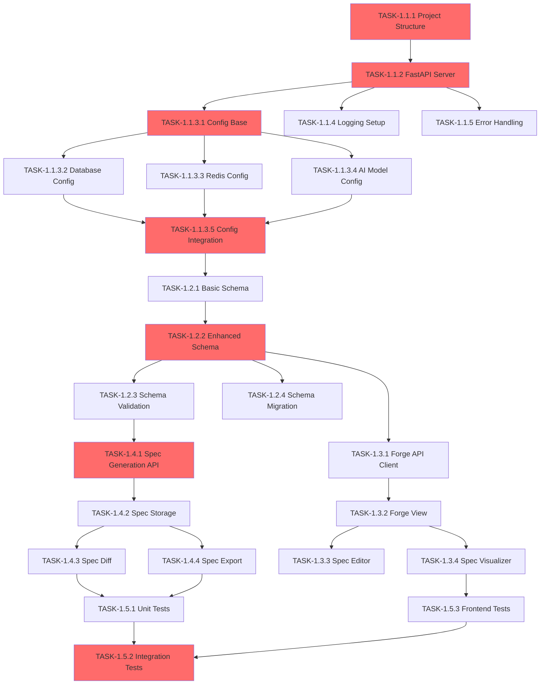

# Phase 1: Foundation & Contract (骨架与契约) 🔥 P0

**目标**: 建立项目基础架构和 OpenSpec 契约层
**周期**: Week 1 (5 工作日)
**状态**: ✅ **已完成** (28/28 任务，100%)

## 概述

Phase 1 是整个 Enterprise Forge 项目的基础阶段，专注于建立坚实的技术架构和 OpenSpec 契约层。这个阶段为后续的 Skills-based RAG、代码生成和 TFS 集成奠定了基础。

## 核心目标

1. **建立后端基础设施** - FastAPI 服务器、配置管理、日志系统
2. **定义 OpenSpec 模式** - 完整的数据模型和验证机制
3. **实现前端集成** - Forge 界面和 OpenSpec 可视化
4. **构建基础工作流** - 生成、存储、版本管理、生命周期管理
5. **确保质量保障** - 完整的测试覆盖

---

## 1.1 Backend Infrastructure (后端基础设施)

### [TASK-1.1.1] Project Structure ✅
**目标**: 初始化 Python 后端项目结构 (`backend/`)

**实现内容**:
- 创建 `backend/` 目录
- 配置 `pyproject.toml` 和 `uv` 环境
- 创建 `app/` 模块目录
- **验收标准**: 目录结构清晰，`uv` 可正常安装依赖

### [TASK-1.1.2] FastAPI Server ✅
**目标**: 搭建 FastAPI 服务器 (`backend/main.py`)

**实现内容**:
- 创建 FastAPI 应用实例
- 配置 CORS 中间件
- 实现健康检查端点 `/health`
- **验收标准**: 服务器可启动，健康检查返回 200

### [TASK-1.1.3] Environment Config ✅
**目标**: 环境配置管理 (细化为 5 个子任务)

#### [TASK-1.1.3.1] Config Base Class ✅
- 文件: `backend/app/config/base.py`
- 创建 `BaseConfig` Pydantic 类
- 实现 `.env` 文件加载
- 添加配置验证
- **工作量**: 0.5天
- **验收标准**: 可加载 .env 文件，类型安全

#### [TASK-1.1.3.2] Database Config ✅
- 文件: `backend/app/config/database.py`
- 创建 `DatabaseConfig` 类
- 配置项：host, port, database, user, password
- 连接字符串生成
- **工作量**: 0.5天
- **验收标准**: 可生成有效的数据库连接字符串

#### [TASK-1.1.3.3] Redis Config ✅
- 文件: `backend/app/config/redis.py`
- 创建 `RedisConfig` 类
- 配置项：host, port, password, db
- 连接池配置
- **工作量**: 0.5天
- **验收标准**: 可连接 Redis，支持连接池

#### [TASK-1.1.3.4] AI Model Config ✅
- 文件: `backend/app/config/ai_models.py`
- 创建 `AIModelConfig` 类
- 配置项：provider, model_name, api_key, temperature
- 多模型配置支持
- **工作量**: 1天
- **验收标准**: 支持 3+ 模型提供商配置

#### [TASK-1.1.3.5] Config Integration & Tests ✅
- 文件: `backend/app/config/__init__.py`
- 集成所有配置模块
- 编写单元测试
- 配置文档
- **工作量**: 0.5天
- **验收标准**: 测试覆盖率 > 80%，文档完整

### [TASK-1.1.4] Logging Setup ✅
**目标**: 日志系统配置 (`backend/app/logger.py`)

**实现内容**:
- 配置结构化日志（JSON 格式）
- 日志级别可配置
- 支持文件和控制台输出
- **验收标准**: 日志格式统一，可追踪请求 ID

### [TASK-1.1.5] Error Handling ✅
**目标**: 全局错误处理 (`backend/app/exceptions.py`)

**实现内容**:
- 自定义异常类
- 全局异常处理器
- 统一错误响应格式
- **验收标准**: 所有错误返回统一格式，包含错误码和消息

---

## 1.2 OpenSpec Schema (OpenSpec 模式定义)

### [TASK-1.2.1] Basic Schema ✅
**目标**: 基础 OpenSpec 模型 (`backend/app/schemas.py`)

**实现内容**:
- `Requirement` 模型（summary, description, acceptance_criteria）
- `Task` 模型（id, title, description, status）
- `OpenSpec` 模型（spec_version, project_name, requirement, tasks）
- **验收标准**: Pydantic 模型定义完整，可序列化为 JSON

### [TASK-1.2.2] Enhanced Schema ✅
**目标**: 增强 OpenSpec 模型到 v0.2

**实现内容**:
- 添加 `Design` 模型（architecture_overview, api_endpoints, data_models）
- 添加 `Workflow` 模型（nodes, edges）
- 添加 `Collaboration` 模型（owner, collaborators, shared）
- 添加 `Metadata` 模型（created_at, updated_at, tfs_work_item_id）
- **验收标准**: 符合 v0.2 规范，支持完整的项目信息

### [TASK-1.2.3] Schema Validation ✅
**目标**: 模式验证器 (`backend/app/validators.py`)

**实现内容**:
- 验证 OpenSpec 完整性
- 验证任务依赖关系
- 验证工作流 DAG 无环
- **验收标准**: 能检测出无效的 OpenSpec，提供清晰的错误信息

### [TASK-1.2.4] Schema Migration ✅
**目标**: 模式迁移工具 (`backend/app/schema_migration.py`)

**实现内容**:
- v0.1 到 v0.2 的迁移函数
- 向后兼容性支持
- 迁移测试用例
- **验收标准**: 旧版本 OpenSpec 可自动升级到新版本

---

## 1.3 Frontend Integration (前端集成)

### [TASK-1.3.1] Forge API Client ✅
**目标**: Forge API 客户端 (`packages/app/src/app/lib/forge.ts`)

**实现内容**:
- `generateSpec()` 函数
- `checkForgeHealth()` 函数
- TypeScript 类型定义
- **验收标准**: 可调用后端 API，类型安全

### [TASK-1.3.2] Forge View ✅
**目标**: Forge 视图组件 (`packages/app/src/app/pages/forge.tsx`)

**实现内容**:
- 需求输入表单（summary, description）
- OpenSpec 展示区域
- 健康状态指示器
- **验收标准**: UI 响应流畅，可生成和展示 OpenSpec

### [TASK-1.3.3] Spec Editor ✅
**目标**: OpenSpec 编辑器组件 (`packages/app/src/app/components/spec-editor.tsx`)

**实现内容**:
- JSON 编辑器（Monaco Editor 或 CodeMirror）
- 语法高亮和自动补全
- 实时验证
- **验收标准**: 可编辑 OpenSpec JSON，实时显示验证错误

### [TASK-1.3.4] Spec Visualizer ✅
**目标**: OpenSpec 可视化组件 (`packages/app/src/app/components/spec-visualizer.tsx`)

**实现内容**:
- 需求卡片展示
- 任务列表展示
- 设计概览展示
- **验收标准**: 清晰展示 OpenSpec 各部分，支持折叠/展开

---

## 1.4 Basic Workflow (基础工作流)

### [TASK-1.4.1] Spec Generation API ✅
**目标**: Spec 生成 API (`backend/main.py` - `/spec/generate`)

**实现内容**:
- 接收 Requirement 输入
- 调用 AgentSwarm 生成 OpenSpec
- 返回完整的 OpenSpec JSON
- **验收标准**: API 可正常调用，返回有效的 OpenSpec

### [TASK-1.4.2] Spec Storage ✅
**目标**: Spec 存储服务 (`backend/app/spec_storage.py`)

**实现内容**:
- 保存 OpenSpec 到项目本地文件系统
- 存储位置：`.openwork/specs/{requirement_id}/`
- 草稿阶段：保存为 `draft.json`（覆盖式保存，不创建版本）
- 与需求ID强关联
- 加载 OpenSpec 从文件系统
- 列出项目的所有 OpenSpec
- **验收标准**: OpenSpec 可持久化到本地，与需求ID关联

### [TASK-1.4.3] Spec Diff ✅
**目标**: Spec 差异对比 (`backend/app/spec_diff.py`)

**实现内容**:
- 对比两个 OpenSpec 版本
- 生成差异报告
- 支持合并操作
- **验收标准**: 准确识别差异，差异报告清晰

### [TASK-1.4.4] Spec Export ✅
**目标**: Spec 导出功能 (`backend/app/spec_export.py`)

**实现内容**:
- 导出为 Markdown 文档
- 导出为 PDF（可选）
- 导出为 HTML
- **验收标准**: 导出的文档格式正确，可读性好

### [TASK-1.4.5] Spec Versioning ✅ 🆕
**目标**: Spec 版本管理 (`backend/app/spec_versioning.py`)

**版本策略**:
- 审批前（draft/review 状态）：只保存 `draft.json`，不创建版本号
- 审批通过后（approved 状态）：生成 v1 版本，保存为 `v1.json`
- 后续修改：每次审批通过后创建新版本（v2, v3...）

**实现内容**:
- 存储格式：`.openwork/specs/{requirement_id}/v{version}.json`
- 版本元数据：创建时间、审批者、审批时间、变更摘要
- 支持回滚到历史版本
- 版本比较和差异查看
- **工作量**: 1天
- **验收标准**: 审批前不创建版本，审批后自动生成版本号，版本历史完整

### [TASK-1.4.6] Spec Lifecycle Management ✅ 🆕
**目标**: OpenSpec 生命周期管理 (`backend/app/spec_lifecycle.py`)

**状态管理**:
- `draft`（草稿）：AI 生成后的初始状态，可随意修改，只保存 `draft.json`
- `review`（审批中）：研发提交审批，等待审批人确认
- `approved`（已审批）：审批通过，**自动生成版本号**（v1, v2...）
- `archived`（已归档）：开发完成后归档

**状态转换规则**:
- draft → review：研发确认计划，提交审批
- review → approved：审批人通过，**触发版本生成**
- review → draft：审批人退回，继续修改
- approved → archived：开发完成，自动归档

**实现内容**:
- 审批流程：需要审批人确认后才能进入 approved 状态
- 状态变更历史记录
- 状态变更通知（邮件/钉钉）
- **工作量**: 1天
- **验收标准**: 状态管理准确，审批通过后自动生成版本号，状态变更可追溯

### [TASK-1.4.7] Spec Archive to TFS 🔄
**目标**: OpenSpec 归档到 TFS (可选) (`backend/app/tfs/spec_archive.py`)

**注意**: 此功能为可选，主要存储在项目本地

**实现内容**:
- 将审批通过的 OpenSpec 归档到 TFS（可选）
- 关联到需求 Work Item（作为附件或链接）
- 存储位置：TFS 文档库或 Git 仓库（`docs/specs/`）
- 归档元数据：需求ID、版本号、归档时间、状态
- 支持查询：通过需求ID查询归档的 OpenSpec
- **工作量**: 1天
- **优先级**: P1（可选功能，MVP 后实现）
- **验收标准**: OpenSpec 可归档到 TFS，可通过需求ID查询，归档成功率 > 99%

---

## 1.4.8 Frontend UI for Workflow (工作流前端 UI) ✅

### [TASK-1.4.8] Spec Version Management UI ✅
**目标**: 版本管理界面 (`packages/app/src/app/pages/spec-versions.tsx`)

**实现内容**:
- 版本列表展示（表格形式，显示版本号、创建时间、审批者、状态）
- 版本详情查看（点击版本号查看完整 OpenSpec）
- 版本对比功能（选择两个版本进行 Diff 对比）
- 版本回滚操作（回滚到指定版本，需确认）
- 版本归档标记（标记版本为已归档）
- **工作量**: 2天
- **验收标准**: 可查看所有版本，对比清晰，回滚安全

### [TASK-1.4.9] Spec Lifecycle Management UI ✅
**目标**: 生命周期管理界面 (`packages/app/src/app/pages/spec-lifecycle.tsx`)

**实现内容**:
- 状态流转可视化（显示当前状态：draft/review/approved/archived）
- 状态变更历史时间线（显示所有状态变更记录）
- 当前状态操作按钮（根据状态显示可用操作）
- 审批流程展示（显示审批人、审批时间、审批意见）
- **工作量**: 1.5天
- **验收标准**: 状态流转清晰，历史可追溯，操作直观

### [TASK-1.4.10] Spec Approval Workflow Component ✅
**目标**: 审批工作流组件 (`packages/app/src/app/components/spec-approval-workflow.tsx`)

**实现内容**:
- 提交审批按钮（draft → review）
- 审批确认对话框（审批通过/退回，填写审批意见）
- 审批进度指示器（显示审批状态）
- 审批历史记录（显示所有审批记录）
- **工作量**: 1天
- **验收标准**: 审批流程流畅，确认清晰，历史完整

### [TASK-1.4.11] Spec Diff Viewer Component ✅
**目标**: 版本对比查看器 (`packages/app/src/app/components/spec-diff-viewer.tsx`)

**实现内容**:
- Diff 可视化展示（自定义组件实现）
- 变更高亮（新增/删除/修改用不同颜色标识）
- 并排对比模式（左右对比两个版本）
- 统一对比模式（单列显示变更）
- 变更统计（显示新增/删除/修改的行数）
- **工作量**: 1.5天
- **验收标准**: Diff 清晰，高亮准确，可切换模式

### [TASK-1.4.12] Spec Export Modal Component ✅
**目标**: 导出功能组件 (`packages/app/src/app/components/spec-export-modal.tsx`)

**实现内容**:
- 导出格式选择（Markdown, HTML, JSON）
- 导出选项配置（包含哪些部分、样式选择）
- 导出预览（预览导出后的效果）
- 下载按钮（触发下载）
- **工作量**: 1天
- **验收标准**: 支持多种格式，预览准确，下载成功

### [TASK-1.4.13] Forge View Enhancement ✅
**目标**: Forge 视图增强 (`packages/app/src/app/pages/forge.tsx` 更新)

**实现内容**:
- 集成版本管理入口（显示版本列表按钮）
- 集成生命周期状态显示（显示当前状态徽章）
- 集成审批工作流（显示审批按钮和状态）
- 集成导出功能（显示导出按钮）
- **工作量**: 1天
- **验收标准**: 所有功能集成完整，交互流畅

---

## 1.5 Phase 1 Testing (Phase 1 测试) 🧪

### [TASK-1.5.1] Unit Tests ✅
**目标**: 单元测试 (`backend/tests/test_phase1_*.py`)

**实现内容**:
- Config 模块单元测试
- Schema 验证单元测试
- API 端点单元测试
- **工作量**: 1天
- **验收标准**: 覆盖率 > 80%，所有测试通过

### [TASK-1.5.2] Integration Tests ✅
**目标**: 集成测试 (`backend/tests/integration/test_phase1.py`)

**实现内容**:
- API → Schema → Storage 集成测试
- 错误处理流程测试
- **工作量**: 0.5天
- **验收标准**: 主要流程测试通过

### [TASK-1.5.3] Frontend Tests ✅
**目标**: 前端测试 (`packages/app/src/app/__tests__/forge.test.tsx`)

**实现内容**:
- Forge 组件测试
- API Client 测试
- **工作量**: 0.5天
- **验收标准**: 组件测试通过

---

## 1.6 Phase 1 Task Dependencies (任务依赖关系) 📊



### 并行任务组
- ✅ **组 A** (可并行): TASK-1.1.3.2, TASK-1.1.3.3, TASK-1.1.3.4 (不同配置模块)
- ✅ **组 B** (可并行): TASK-1.1.4, TASK-1.1.5 (日志和错误处理)
- ✅ **组 C** (可并行): TASK-1.2.3, TASK-1.2.4 (验证和迁移)
- ✅ **组 D** (可并行): TASK-1.3.3, TASK-1.3.4 (编辑器和可视化)
- ✅ **组 E** (可并行): TASK-1.4.3, TASK-1.4.4 (Diff 和 Export)

### 关键路径 (Critical Path)
```
A → B → C1 → C5 → G → N → T
总工期: 约 5 天
```

---

## 成功指标

### Week 1 (Phase 1) 成功指标
- ✅ Backend 服务可启动，健康检查通过
- ✅ OpenSpec v0.2 Schema 定义完整
- ✅ Forge UI 可生成和展示 OpenSpec
- ✅ 单元测试覆盖率 > 80%

### 验收标准
- ✅ 所有 28 个任务完成
- ✅ 基础架构稳定运行
- ✅ OpenSpec 契约层完整
- ✅ 前端 UI 功能完整
- ✅ 版本管理和生命周期管理正常工作
- ✅ 测试覆盖率达标

---

## 总结

Phase 1 已成功完成，为整个 Enterprise Forge 项目奠定了坚实的基础。主要成就包括：

1. **完整的后端架构** - FastAPI + 配置管理 + 日志 + 错误处理
2. **完善的 OpenSpec 模式** - v0.2 规范 + 验证 + 迁移
3. **功能完整的前端** - Forge 界面 + 编辑器 + 可视化
4. **完整的工作流** - 生成 + 存储 + 版本管理 + 生命周期管理
5. **质量保障** - 单元测试 + 集成测试 + 前端测试

这为 Phase 2 的 Skills-based RAG 和代码生成功能提供了稳定的基础平台。